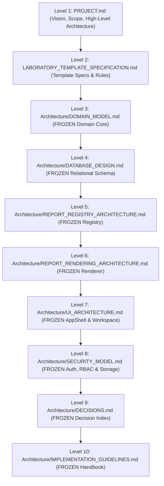
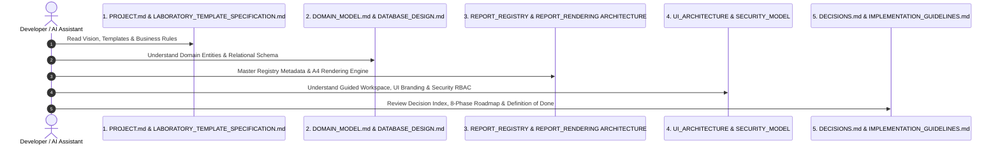
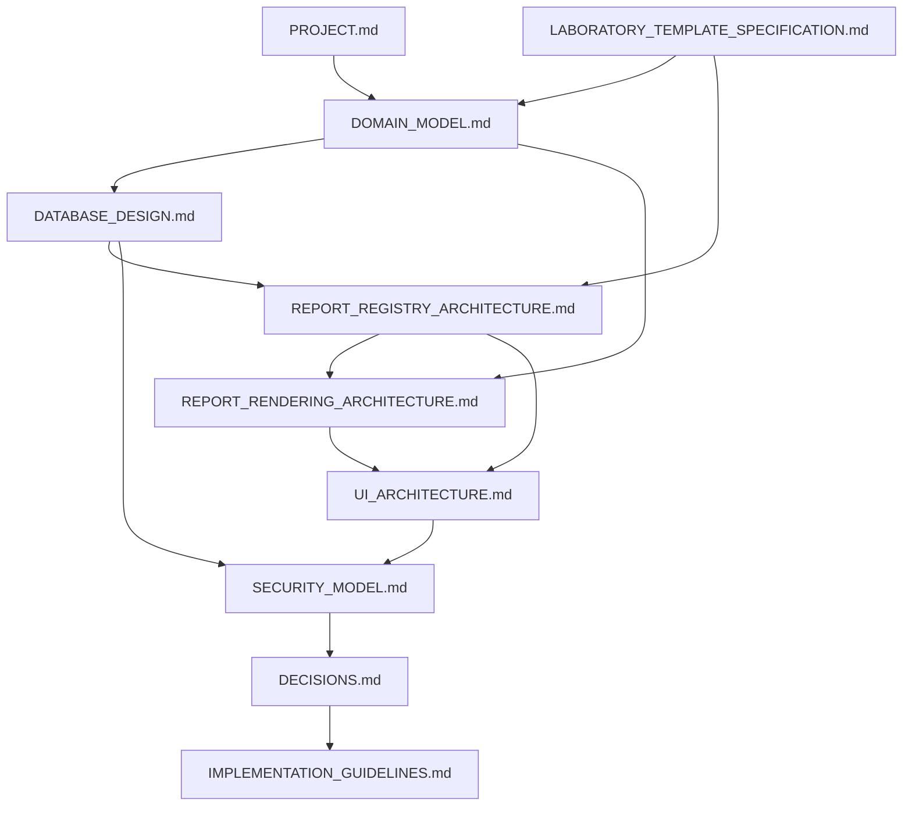

# St. Rose Laboratory Result Management System
## Architecture Navigation & Authority Map

---

# 1. Overview & Purpose

This document serves as the official **Architecture Navigation & Authority Map** for the **St. Rose Laboratory Result Management System**.

It defines the authority hierarchy, document responsibility matrix, recommended onboarding reading order, architectural dependency map, frozen baseline registry, open decision log, and formal change-control rules across all project documentation.

---

# 2. Authority Hierarchy

All documentation and code operate strictly under the following 10-level authority hierarchy (Highest → Lowest):

> **AUTHORITY RULE**: Higher-level documents always supersede lower-level documents in case of ambiguity. Lower-level documents must never contradict higher-level specifications.

---

# 3. Document Responsibility Matrix

| Document Path | Primary Architectural Concern | Authority Level | Status |
|---|---|---|---|
| `PROJECT.md` | Overall project vision, roadmap, technology stack, system-wide rules | Level 1 | Active |
| `LABORATORY_TEMPLATE_SPECIFICATION.md` | Authoritative specification for all 17 templates, parameters, and rules | Level 2 | Active |
| `Architecture/DOMAIN_MODEL.md` | Business domain entities, aggregates, lifecycles, ubiquitous language | Level 3 | **FROZEN** |
| `Architecture/DATABASE_DESIGN.md` | Supabase PostgreSQL schema, 10 tables, indexes, RLS policies | Level 4 | **FROZEN** |
| `Architecture/REPORT_REGISTRY_ARCHITECTURE.md` | Metadata registry engine, input types, reference rules, computed formulas | Level 5 | **FROZEN** |
| `Architecture/REPORT_RENDERING_ARCHITECTURE.md` | Physical A4 layouts, shared rendering engine, 4 renderer families, page breaks | Level 6 | **FROZEN** |
| `Architecture/UI_ARCHITECTURE.md` | AppShell, guided encoding workspace, dual branding, keyboard workflows | Level 7 | **FROZEN** |
| `Architecture/SECURITY_MODEL.md` | Supabase Auth, RBAC roles (`Admin`/`User`), identity decoupling, signature security | Level 8 | **FROZEN** |
| `Architecture/DECISIONS.md` | High-level index of confirmed architectural decisions (DEC-001 to DEC-026) | Level 9 | **FROZEN** |
| `Architecture/IMPLEMENTATION_GUIDELINES.md` | Engineering handbook, 8-phase implementation roadmap, Definition of Done | Level 10 | **FROZEN** |
| `Architecture/ADR/ADR-*.md` | Contextual architectural decision records detailing historical trade-offs | Supporting | Active |

---

# 4. Recommended Reading Order for Developers & AI Assistants

Engineers and AI assistants onboarding to this codebase must read the documents in the following order:

1. **Step 1: Understand Vision & Template Specs**: Read `PROJECT.md` and `LABORATORY_TEMPLATE_SPECIFICATION.md` to grasp project scope and official template rules.
2. **Step 2: Master Domain & Database**: Read `DOMAIN_MODEL.md` and `DATABASE_DESIGN.md` to understand entities, aggregate roots, and the 10 PostgreSQL tables.
3. **Step 3: Master Metadata & Rendering**: Read `REPORT_REGISTRY_ARCHITECTURE.md` and `REPORT_RENDERING_ARCHITECTURE.md` to understand template metadata generation and shared A4 output rendering.
4. **Step 4: Understand UI & Security**: Read `UI_ARCHITECTURE.md` and `SECURITY_MODEL.md` to master the guided encoding workspace, dual branding rules, and RBAC policies.
5. **Step 5: Review Decisions & Execution Rules**: Read `DECISIONS.md` and `IMPLEMENTATION_GUIDELINES.md` to understand confirmed decisions, the 8-phase implementation roadmap, and the Definition of Done.

---

# 5. Architecture Dependency Map

---

# 6. Frozen Architecture Baseline

The following 8 core architecture specifications are explicitly **FROZEN** for Milestone 2:

1. `Architecture/DOMAIN_MODEL.md` (Frozen)
2. `Architecture/DATABASE_DESIGN.md` (Frozen)
3. `Architecture/REPORT_REGISTRY_ARCHITECTURE.md` (Frozen)
4. `Architecture/REPORT_RENDERING_ARCHITECTURE.md` (Frozen)
5. `Architecture/UI_ARCHITECTURE.md` (Frozen)
6. `Architecture/SECURITY_MODEL.md` (Frozen)
7. `Architecture/DECISIONS.md` (Frozen)
8. `Architecture/IMPLEMENTATION_GUIDELINES.md` (Frozen)

## 6.1 Change-Control Rules

- **Zero Unapproved Edits**: Frozen architecture documents must **NEVER** be modified during routine code implementation or refactoring.
- **Formal Approval Protocol**: A frozen document may only be modified if a new client requirement or approved architectural decision change occurs.
- **Traceability**: All architectural changes must be logged in `DECISIONS.md` and referenced in an ADR.

---

# 7. Unresolved Open Decisions Log

> [!WARNING]
> **OPEN-01: Completed Report Visibility & Edit Scope Across Standard Users**
> - **Status**: **Awaiting Client Confirmation**.
> - **Statement**: *"Completed Report visibility and edit scope across different users requires client confirmation."*
> - **Details**: Authority documents confirm `Admin` accounts have system-wide access. However, they do not establish whether standard `User` accounts may view/edit **all completed reports system-wide** or **only sessions they originally created**.
> - **Constraint**: To preserve requirements integrity, this scope is **NOT** inferred or hardcoded in architecture. The database RLS architecture permits either policy once client confirmation is received.

---

# 8. Where to Look for Specific Concerns

- **Project Vision, Roadmap & Tech Stack**: `PROJECT.md`
- **Official Laboratory Template Specs**: `LABORATORY_TEMPLATE_SPECIFICATION.md`
- **Domain Aggregates & Business Rules**: `Architecture/DOMAIN_MODEL.md`
- **Relational Tables, Indexes & RLS DDL**: `Architecture/DATABASE_DESIGN.md`
- **Template Parameters, Metadata & Rules**: `Architecture/REPORT_REGISTRY_ARCHITECTURE.md`
- **A4 Rendering Pipeline, Layouts & Fonts**: `Architecture/REPORT_RENDERING_ARCHITECTURE.md`
- **AppShell, Guided Workspace & UI Tokens**: `Architecture/UI_ARCHITECTURE.md`
- **Supabase Auth, RBAC & Signature Protection**: `Architecture/SECURITY_MODEL.md`
- **Confirmed Decision Index (DEC-001 to DEC-026)**: `Architecture/DECISIONS.md`
- **Folder Structure, Coding Rules & DoD**: `Architecture/IMPLEMENTATION_GUIDELINES.md`
- **Historical Architectural Rationale**: `Architecture/ADR/`
