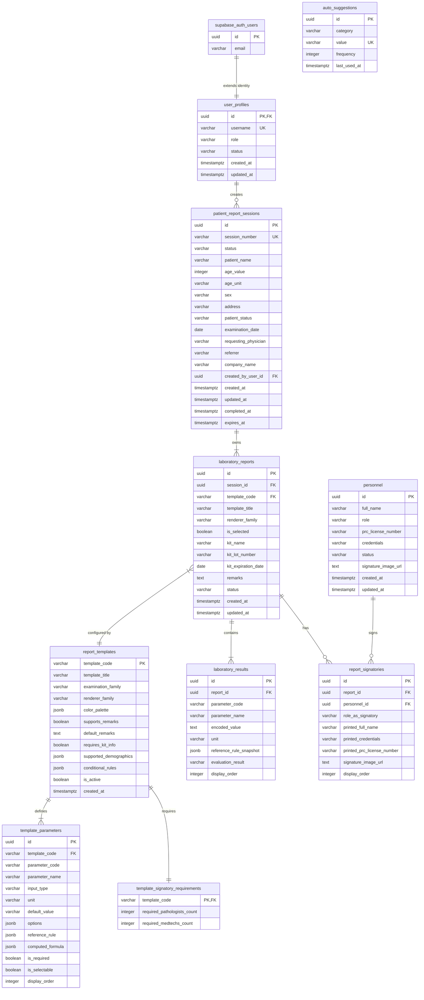

# St. Rose Laboratory Result Management System
## Relational Database Architecture & Schema Specification

---

# 1. Purpose & Architectural Status

This document defines the official **Database Architecture & PostgreSQL Schema Specification** for the **St. Rose Laboratory Result Management System**.

It provides a production-ready relational database design that faithfully maps the frozen **Business Domain Model** ([Architecture/DOMAIN_MODEL.md](file:///c:/Projects/St-rose-laboratory-result-management-system/Architecture/DOMAIN_MODEL.md)) to Supabase PostgreSQL.

## 1.1 Authority Hierarchy Alignment

This document operates strictly within the project authority hierarchy:

1. **PROJECT.md**: Authoritative source for project vision, milestone roadmaps, technology stack, and system-wide business rules.
2. **LABORATORY_TEMPLATE_SPECIFICATION.md**: Authoritative specification for official laboratory report templates, parameter definitions, reference rules, signatories, and renderer behavior.
3. **Architecture/DOMAIN_MODEL.md (FROZEN)**: Authoritative business domain specification defining entities, aggregate roots, value objects, domain services, lifecycles, and business invariants.
4. **Current Source Code**: Contextual reference only. Code never overrides database specifications.

## 1.2 Scope & Technical Boundaries

- **IN SCOPE**: Supabase Auth integration model, application user profiles, table schemas, data types, primary/foreign keys, nullability rules, cascade delete behavior, historical snapshot fields, indexing strategies, CHECK constraints, JSONB schema specifications, Row-Level Security (RLS) policies, and 30-day retention purge routines.
- **EXCLUDED**: React component state, Next.js page routes, CSS design tokens, PDF rendering logic, and UI layout code.

---

# 2. Database Architectural Principles & Standards

## 2.1 Core Database Principles

1. **Faithful Domain Mapping**: Relational tables map 1:1 to domain aggregates and entities established in `DOMAIN_MODEL.md`.
2. **Supabase Auth Integration**: Passwords and core authentication identities are managed strictly by Supabase Auth (`auth.users`). Application profiles and roles (`Admin`, `User`) reside in `user_profiles` referencing `auth.users(id)`. No credentials or password hashes are duplicated.
3. **Decoupled Authentication vs. Personnel**: `user_profiles` (application login access) and `personnel` (PRC-licensed medical professionals printed on reports) are strictly separate tables with no foreign key dependencies.
4. **Refined Template Extensibility**:
   - A new laboratory template using existing renderer families (`Tabular`, `SimpleResult`, `DiagnosticGrid`, `NarrativeCertificate`), supported input types, and existing reference rule strategies is configuration-only (requiring SQL `INSERT` rows into `report_templates` and `template_parameters`).
   - A genuinely new renderer family, custom calculation logic, novel input behavior, or custom rendering layout requires application code implementation.
   - Adding a new template must **never** require modifying existing templates or their schemas.
5. **Historical Output Fidelity via Completion Snapshots**: When a report session transitions to `Completed`, snapshot fields (signatory printed names, credentials, PRC license numbers, signature image URLs, parameter names, units, and reference rules) are frozen into `report_signatories` and `laboratory_results`. Future changes to master `personnel` or master `template_parameters` will not alter previously completed reports upon reopening or re-printing within the 30-day retention window. No complex multi-versioning is introduced; the initial release maintains single-record "Replace Current Report" semantics.
6. **Strict Deselected Parameter Omission**: Deselected parameters (`is_selected = false`) do not undergo validation, do not trigger reference evaluation, do not appear in Preview/Print/PDF, and are **NOT persisted** in `laboratory_results`. Only active, selected parameters are stored.
7. **Explicit 30-Day Retention Separation**: The 30-day retention expiration (`expires_at = completed_at + INTERVAL '30 days'`) applies **exclusively to COMPLETED sessions**. Unfinished drafts are transient and excluded. Expiration calculation, purge functions, and execution scheduling are explicitly separated.

## 2.2 Database Conventions & Naming Rules

- **Database Engine**: PostgreSQL 15+ (Supabase Managed PostgreSQL).
- **Identifier Casing**: All table names, column names, indexes, constraints, and custom functions use `snake_case`.
- **Table Pluralization**: Table names are pluralized (e.g., `user_profiles`, `patient_report_sessions`, `laboratory_reports`, `personnel`).
- **Primary Keys**: Every application table uses a surrogate primary key column named `id` of type `UUID` generated via `gen_random_uuid()` (or matching `auth.users(id)` for `user_profiles`).
- **Foreign Keys**: Named `<singular_referenced_table_name>_id` (e.g., `session_id`, `report_id`, `personnel_id`, `user_id`).
- **Timestamps**: All timestamp columns use `TIMESTAMPTZ` (Timestamp with Time Zone) defaulting to `NOW()`.
- **Enum Handling**: Enumerated domain states are stored as checked `VARCHAR` strings with explicit `CHECK` constraints.

---

# 3. Entity-Relationship (ER) Architecture Diagram



---

# 4. Detailed Table Specifications

## 4.1 Access & Administration Context

### 4.1.1 `user_profiles`
Extends Supabase Auth identity (`auth.users`) with application domain role and account status. No passwords or security credentials are duplicated.

```sql
CREATE TABLE user_profiles (
    id UUID PRIMARY KEY REFERENCES auth.users(id) ON DELETE CASCADE,
    username VARCHAR(50) NOT NULL UNIQUE,
    role VARCHAR(20) NOT NULL CHECK (role IN ('Admin', 'User')),
    status VARCHAR(20) NOT NULL DEFAULT 'Active' CHECK (status IN ('Active', 'Inactive')),
    created_at TIMESTAMPTZ NOT NULL DEFAULT NOW(),
    updated_at TIMESTAMPTZ NOT NULL DEFAULT NOW()
);
```

- **Domain Mapping**: Aggregate Root `AuthenticationUser`.
- **Decoupling Rule**: References `auth.users(id)` for Supabase Auth identity, but maintains **zero** foreign key dependencies with `personnel`.

---

## 4.2 Personnel & Credentials Context

### 4.2.1 `personnel`
Stores licensed Pathologists and Medical Technologists whose signatures appear on printed reports.

```sql
CREATE TABLE personnel (
    id UUID PRIMARY KEY DEFAULT gen_random_uuid(),
    full_name VARCHAR(150) NOT NULL,
    role VARCHAR(30) NOT NULL CHECK (role IN ('Pathologist', 'MedicalTechnologist')),
    prc_license_number VARCHAR(50) NOT NULL,
    credentials VARCHAR(100) NOT NULL,
    status VARCHAR(20) NOT NULL DEFAULT 'Active' CHECK (status IN ('Active', 'Inactive')),
    signature_image_url TEXT NULL,
    created_at TIMESTAMPTZ NOT NULL DEFAULT NOW(),
    updated_at TIMESTAMPTZ NOT NULL DEFAULT NOW()
);
```

- **Domain Mapping**: Aggregate Root `Personnel`.
- **Decoupling Rule**: Has **zero** foreign key references to `user_profiles` or `auth.users`. Personnel are managed independently.

---

## 4.3 Report Registry Context

### 4.3.1 `report_templates`
Single source of truth for official laboratory template configurations.

```sql
CREATE TABLE report_templates (
    template_code VARCHAR(50) PRIMARY KEY,
    template_title VARCHAR(150) NOT NULL,
    examination_family VARCHAR(50) NOT NULL, -- e.g. "Chemistry", "Hematology", "Microscopy", "Serology"
    renderer_family VARCHAR(50) NOT NULL CHECK (
        renderer_family IN ('Tabular', 'SimpleResult', 'DiagnosticGrid', 'NarrativeCertificate')
    ),
    color_palette JSONB NOT NULL DEFAULT '{"primary": "#000000", "header_bg": "#FFFFFF"}'::jsonb,
    supports_remarks BOOLEAN NOT NULL DEFAULT TRUE,
    default_remarks TEXT NULL,
    requires_kit_info BOOLEAN NOT NULL DEFAULT FALSE,
    supported_demographics JSONB NULL, -- Custom demographic field mapping if template overrides default session mapping
    conditional_rules JSONB NULL, -- Hide empty parameters, conditional visibility, etc.
    is_active BOOLEAN NOT NULL DEFAULT TRUE,
    created_at TIMESTAMPTZ NOT NULL DEFAULT NOW()
);
```

---

### 4.3.2 `template_parameters`
Defines individual parameter specifications per template.

```sql
CREATE TABLE template_parameters (
    id UUID PRIMARY KEY DEFAULT gen_random_uuid(),
    template_code VARCHAR(50) NOT NULL REFERENCES report_templates(template_code) ON DELETE CASCADE,
    parameter_code VARCHAR(50) NOT NULL,
    parameter_name VARCHAR(150) NOT NULL,
    input_type VARCHAR(30) NOT NULL CHECK (
        input_type IN ('NumericText', 'FreeText', 'SingleSelect', 'MultiSelect', 'Computed', 'Combobox')
    ),
    unit VARCHAR(50) NULL, -- e.g. "%", "/HPF", "g/dL", "mmol/L"
    default_value VARCHAR(100) NULL,
    options JSONB NULL, -- For select/combobox: ["Yellow", "Straw", "Amber", "Clear"]
    reference_rule JSONB NOT NULL, -- Evaluation rules (NumericRange, LessThan, GreaterThan, ExpectedValue, AllowedValues, Informational, NoEvaluation)
    computed_formula JSONB NULL, -- Dependency & formula specification for computed parameters
    is_required BOOLEAN NOT NULL DEFAULT TRUE,
    is_selectable BOOLEAN NOT NULL DEFAULT TRUE,
    display_order INTEGER NOT NULL DEFAULT 0,
    CONSTRAINT uq_template_param UNIQUE (template_code, parameter_code)
);
```

---

### 4.3.3 `template_signatory_requirements`
Defines required personnel signatory counts for a template.

```sql
CREATE TABLE template_signatory_requirements (
    template_code VARCHAR(50) PRIMARY KEY REFERENCES report_templates(template_code) ON DELETE CASCADE,
    required_pathologists_count INTEGER NOT NULL DEFAULT 1,
    required_medtechs_count INTEGER NOT NULL DEFAULT 1
);
```

---

## 4.4 Patient Session Context

### 4.4.1 `patient_report_sessions`
Root transactional table for a single patient visit.

```sql
CREATE TABLE patient_report_sessions (
    id UUID PRIMARY KEY DEFAULT gen_random_uuid(),
    session_number VARCHAR(50) NOT NULL UNIQUE,
    status VARCHAR(20) NOT NULL DEFAULT 'Draft' CHECK (
        status IN ('Draft', 'Validating', 'Completed', 'Expired')
    ),
    -- Shared Demographics (Captured Once per Visit)
    patient_name VARCHAR(150) NOT NULL,
    age_value INTEGER NOT NULL CHECK (age_value >= 0),
    age_unit VARCHAR(10) NOT NULL DEFAULT 'Years' CHECK (age_unit IN ('Years', 'Months', 'Days')),
    sex VARCHAR(10) NOT NULL CHECK (sex IN ('Male', 'Female')),
    address TEXT NOT NULL,
    patient_status VARCHAR(20) NOT NULL DEFAULT 'OutPatient' CHECK (
        patient_status IN ('OutPatient', 'InPatient', 'ER')
    ),
    examination_date DATE NOT NULL DEFAULT CURRENT_DATE,
    requesting_physician VARCHAR(150) NOT NULL,
    referrer VARCHAR(150) NULL,
    company_name VARCHAR(150) NULL,
    -- Audit & Retention Metadata
    created_by_user_id UUID NOT NULL REFERENCES user_profiles(id) ON DELETE RESTRICT,
    created_at TIMESTAMPTZ NOT NULL DEFAULT NOW(),
    updated_at TIMESTAMPTZ NOT NULL DEFAULT NOW(),
    completed_at TIMESTAMPTZ NULL,
    expires_at TIMESTAMPTZ NULL -- Computed as completed_at + INTERVAL '30 days' upon completion
);
```

- **Domain Invariants**: `INV-001` (1 visit = 1 session), `INV-002` (demographics captured once per visit).

---

### 4.4.2 `laboratory_reports`
Individual test reports belonging to a visit session.

```sql
CREATE TABLE laboratory_reports (
    id UUID PRIMARY KEY DEFAULT gen_random_uuid(),
    session_id UUID NOT NULL REFERENCES patient_report_sessions(id) ON DELETE CASCADE,
    template_code VARCHAR(50) NOT NULL REFERENCES report_templates(template_code) ON DELETE RESTRICT,
    template_title VARCHAR(150) NOT NULL,
    renderer_family VARCHAR(50) NOT NULL,
    is_selected BOOLEAN NOT NULL DEFAULT TRUE,
    -- Reagent / Kit Information (where applicable)
    kit_name VARCHAR(150) NULL,
    kit_lot_number VARCHAR(50) NULL,
    kit_expiration_date DATE NULL,
    remarks TEXT NULL,
    status VARCHAR(20) NOT NULL DEFAULT 'Pending' CHECK (
        status IN ('Pending', 'Validated', 'Complete')
    ),
    created_at TIMESTAMPTZ NOT NULL DEFAULT NOW(),
    updated_at TIMESTAMPTZ NOT NULL DEFAULT NOW()
);
```

---

### 4.4.3 `laboratory_results`
Encoded test parameter results and snapshot reference evaluation outcomes.

```sql
CREATE TABLE laboratory_results (
    id UUID PRIMARY KEY DEFAULT gen_random_uuid(),
    report_id UUID NOT NULL REFERENCES laboratory_reports(id) ON DELETE CASCADE,
    parameter_code VARCHAR(50) NOT NULL,
    parameter_name VARCHAR(150) NOT NULL, -- Frozen parameter name snapshot
    encoded_value TEXT NOT NULL, -- Only active/selected results are persisted
    unit VARCHAR(50) NULL, -- Frozen unit snapshot
    reference_rule_snapshot JSONB NOT NULL, -- Frozen reference rule snapshot at submission time
    evaluation_result VARCHAR(30) NOT NULL DEFAULT 'NoEvaluation' CHECK (
        evaluation_result IN (
            'Normal', 'Abnormal', 'Expected', 'Allowed', 'Informational', 'NoEvaluation'
        )
    ),
    display_order INTEGER NOT NULL DEFAULT 0,
    CONSTRAINT uq_report_parameter UNIQUE (report_id, parameter_code)
);
```

- **Strict Omission Rule**: Only active parameters (`is_selected = true`) are persisted. Deselected parameters (`is_selected = false`) are **omitted from persistence** entirely.

---

### 4.4.4 `report_signatories`
Junction table linking laboratory reports to assigned personnel signatories, capturing frozen historical credentials.

```sql
CREATE TABLE report_signatories (
    id UUID PRIMARY KEY DEFAULT gen_random_uuid(),
    report_id UUID NOT NULL REFERENCES laboratory_reports(id) ON DELETE CASCADE,
    personnel_id UUID NOT NULL REFERENCES personnel(id) ON DELETE RESTRICT,
    role_as_signatory VARCHAR(30) NOT NULL CHECK (
        role_as_signatory IN ('Pathologist', 'MedicalTechnologist')
    ),
    -- Historical Fidelity Snapshot Fields (Frozen at completion time)
    printed_full_name VARCHAR(150) NOT NULL,
    printed_credentials VARCHAR(100) NOT NULL,
    printed_prc_license_number VARCHAR(50) NOT NULL,
    signature_image_url TEXT NULL,
    display_order INTEGER NOT NULL DEFAULT 0,
    CONSTRAINT uq_report_personnel UNIQUE (report_id, personnel_id)
);
```

- **Historical Fidelity Rule**: Captures snapshot of signatory credentials at completion time. Future updates to the `personnel` master table will not alter already completed reports upon re-printing within the 30-day window.

---

## 4.5 Auto Suggestion Context

### 4.5.1 `auto_suggestions`
Autocomplete entries learned after successful session completions.

```sql
CREATE TABLE auto_suggestions (
    id UUID PRIMARY KEY DEFAULT gen_random_uuid(),
    category VARCHAR(50) NOT NULL CHECK (
        category IN ('RequestingPhysician', 'Referrer', 'CompanyName')
    ),
    value VARCHAR(150) NOT NULL,
    frequency INTEGER NOT NULL DEFAULT 1,
    last_used_at TIMESTAMPTZ NOT NULL DEFAULT NOW(),
    CONSTRAINT uq_category_value UNIQUE (category, value)
);
```

- **Ranking Strategy**: Autocomplete queries ORDER BY `frequency DESC, last_used_at DESC, value ASC`.

---

# 5. JSONB vs Structured Relational Strategy

To achieve optimum performance while preserving flexibility, the database employs a hybrid strategy:

| Data Element | Storage Format | Justification |
|---|---|---|
| **Patient Demographics** | Structured Columns | Frequently queried, indexed, and filtered across sessions |
| **Session & Report Status** | Structured Columns | Checked with `CHECK` constraints to ensure strict state transitions |
| **Parameter Definitions** | Structured Columns + `JSONB` options | Structured metadata for queries; `JSONB` for dynamic selection lists and combobox options |
| **Reference Rules (Master)** | `JSONB` in `template_parameters` | Accommodates multi-type rules (`NumericRange`, `LessThan`, `AllowedValues`) cleanly |
| **Reference Rule Snapshot** | `JSONB` in `laboratory_results` | Guarantees historical report fidelity even if master template reference rules change |
| **Signatory Credentials Snapshot** | Structured Columns in `report_signatories` | Guarantees printed signatory fidelity if master `personnel` record is updated |
| **Template Color Palette** | `JSONB` in `report_templates` | Isolates report colors per template without adding clutter columns |

---

# 6. Indexing & Performance Optimization

```sql
-- 1. Index for active session lookups and filtering
CREATE INDEX idx_sessions_status_date ON patient_report_sessions(status, examination_date DESC);

-- 2. Index for 30-day retention cleanup routine (applies only to Completed sessions)
CREATE INDEX idx_sessions_expires_at ON patient_report_sessions(expires_at) WHERE status = 'Completed';

-- 3. Index for report lookups by session
CREATE INDEX idx_reports_session_id ON laboratory_reports(session_id);

-- 4. Index for results lookup by report
CREATE INDEX idx_results_report_id ON laboratory_results(report_id);

-- 5. Index for autocomplete suggestions ranking
CREATE INDEX idx_suggestions_category_rank ON auto_suggestions(category, frequency DESC, last_used_at DESC, value ASC);

-- 6. Index for personnel active status lookup
CREATE INDEX idx_personnel_role_status ON personnel(role, status);
```

---

# 7. Retention Policy & Execution Architecture

To enforce `INV-008` (30-day retention period for completed reports), the retention architecture is strictly separated into three distinct components:

1. **Expiration Calculation**: When a session transitions to `Completed`, the system sets `expires_at = completed_at + INTERVAL '30 days'`. Drafts leave `expires_at` as `NULL`.
2. **Purge SQL Function**: Reusable database function to execute cleanup:
   ```sql
   CREATE OR REPLACE FUNCTION purge_expired_report_sessions()
   RETURNS INTEGER AS $$
   DECLARE
       purged_count INTEGER;
   BEGIN
       WITH deleted_rows AS (
           DELETE FROM patient_report_sessions
           WHERE status = 'Completed'
             AND expires_at IS NOT NULL
             AND expires_at < NOW()
           RETURNING id
       )
       SELECT COUNT(*) INTO purged_count FROM deleted_rows;
       
       RETURN purged_count;
   END;
   $$ LANGUAGE plpgsql;
   ```
3. **Scheduled Execution Mechanism**: The SQL function is triggered periodically by a background scheduler (e.g., Supabase Scheduled Functions, `pg_cron`, or Vercel Cron Jobs, to be configured during production deployment).

---

# 8. Row-Level Security (RLS) Policy Architecture

All application tables enable Supabase Row-Level Security (`ALTER TABLE ... ENABLE ROW LEVEL SECURITY;`). Policies map strictly to confirmed domain roles (`Admin`, `User`):

- **`user_profiles`**:
  - `Admin`: Full SELECT, INSERT, UPDATE, DELETE permissions.
  - `User`: SELECT permission for their own profile record.
- **`personnel`**:
  - All authenticated users: SELECT permission for active/inactive staff lists.
  - `Admin`: INSERT and UPDATE permissions.
- **`report_templates` & `template_parameters` & `template_signatory_requirements`**:
  - All authenticated users: SELECT permission for template definitions.
  - `Admin`: INSERT, UPDATE, DELETE permissions for template management.
- **`patient_report_sessions`, `laboratory_reports`, `laboratory_results`, `report_signatories`**:
  - All authenticated users (`Admin` and `User`): SELECT, INSERT, UPDATE permissions to process patient visits.
  - Automated purge function / system process: DELETE permissions for expired completed sessions.
- **`auto_suggestions`**:
  - All authenticated users: SELECT permission for autocomplete lookups; INSERT and UPDATE permissions upon session completion.

---

# 9. Architectural Consistency Verification Matrix

| Domain Requirement / Invariant | Database Architecture Mapping | Verification Status |
|---|---|---|
| **Supabase Auth Integration** | `user_profiles.id` references `auth.users(id)`; no password hash stored | ✅ Pass |
| **Refined Extensibility Rules** | Config-only for existing renderer families; code changes for new renderers | ✅ Pass |
| **INV-001** (1 Visit = 1 Session) | `patient_report_sessions` primary key `id` | ✅ Pass |
| **INV-002** (Shared Demographics) | Demographics stored as columns on `patient_report_sessions` | ✅ Pass |
| **INV-004** (Deselected Results Omission) | Unselected parameters (`is_selected = false`) are NOT persisted in `laboratory_results` | ✅ Pass |
| **INV-005** (Decoupled Auth/Personnel) | `user_profiles` and `personnel` are separate tables with zero FK references | ✅ Pass |
| **INV-006** (Licensed Signatories) | `report_signatories.personnel_id` FK references `personnel.id` | ✅ Pass |
| **INV-007** (Completion Auto Suggestions)| `auto_suggestions` updated only when `status = 'Completed'` | ✅ Pass |
| **INV-008** (30-Day Retention) | `expires_at` on Completed sessions + `purge_expired_report_sessions()` | ✅ Pass |
| **Historical Output Fidelity** | Snapshot fields in `report_signatories` & `laboratory_results` freeze output data | ✅ Pass |
| **Configuration Over Hardcoding** | Metadata in `report_templates` & `template_parameters` drive rendering rules | ✅ Pass |
