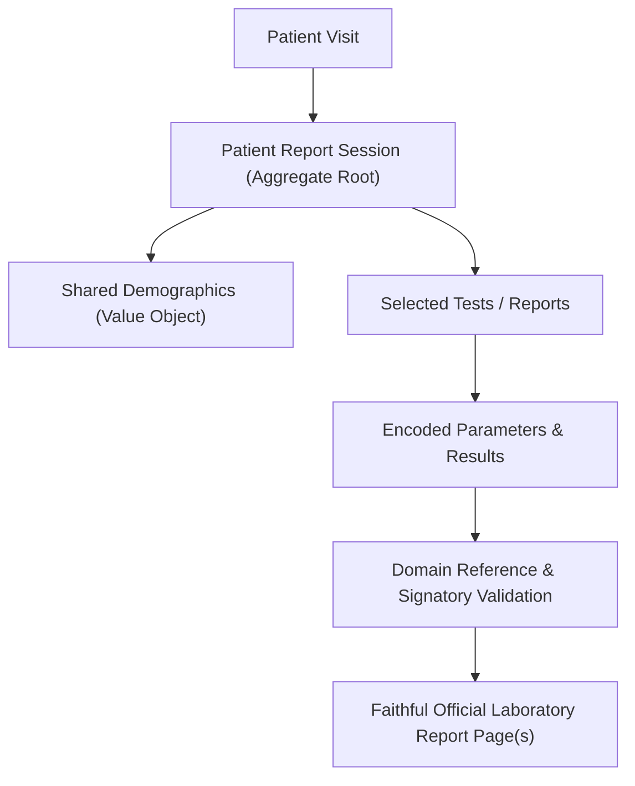
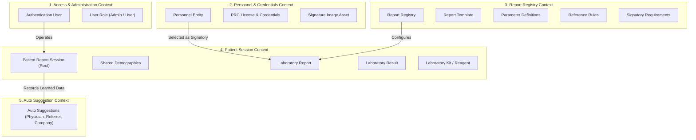
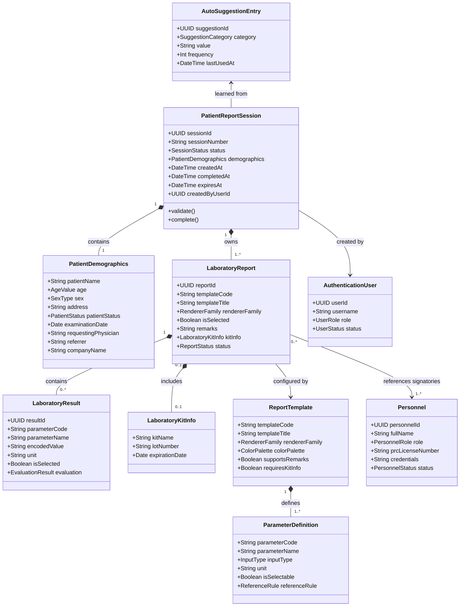
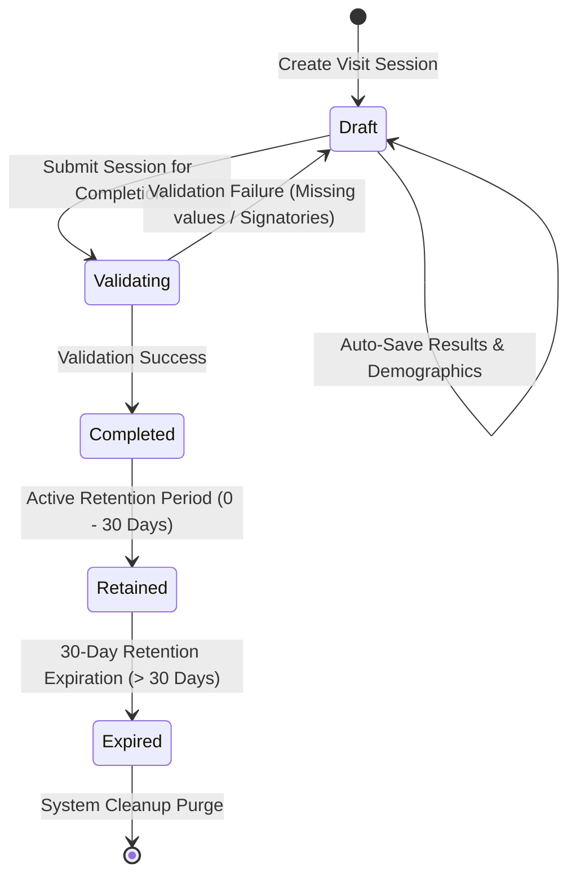

# St. Rose Laboratory Result Management System
## Business Domain Model Specification

---

# 1. Document Purpose & Architectural Status

This document defines the official **Business Domain Model** for the **St. Rose Laboratory Result Management System**. 

It serves as the frozen, authoritative domain specification for **Milestone 2 (Laboratory Domain Foundation)** and subsequent development milestones.

## 1.1 Authority Hierarchy Alignment

This document operates strictly within the project authority hierarchy:

1. **PROJECT.md**: Authoritative source for project vision, milestone roadmaps, technology stack, and high-level business rules.
2. **LABORATORY_TEMPLATE_SPECIFICATION.md**: Authoritative specification for official laboratory report templates, parameter definitions, reference rules, signatories, and renderer behavior.
3. **Microsoft Word Templates (`Templates/`)**: Authoritative source for visual layout, typography, borders, margins, colors, and printed document fidelity.
4. **Current Source Code**: Contextual reference only. Code never overrides authority specifications.

---

# 2. Non-Domain Responsibilities (Explicit Exclusions)

To maintain a strict **Separation of Concerns**, this document focuses **exclusively on the business domain** and explicitly excludes all implementation details.

The following technical concerns are **NOT** defined within `DOMAIN_MODEL.md` and belong strictly to downstream technical architecture documents:

- **Database Schemas & Persistence**: PostgreSQL tables, primary/foreign key relationships, column data types, indexes, database migrations, and SQL queries (governed by `DATABASE_DESIGN.md`).
- **User Interface (UI) Implementation**: Next.js App Router pages, React components, state hooks, form controls, modal dialogs, CSS design tokens, and Tailwind utility classes (governed by `UI_ARCHITECTURE.md`).
- **Report Rendering Implementation**: HTML DOM structures, CSS `@page` print rules, PDF conversion engines, browser print handlers, and font loading mechanisms (governed by `REPORT_RENDERING_ARCHITECTURE.md`).
- **API & Service Integration**: REST/GraphQL endpoints, HTTP request/response payloads, Supabase SDK client calls, and middleware authentication routes.
- **Storage & Infrastructure**: Supabase Storage bucket configurations, file upload mechanisms, Vercel hosting, CI/CD pipelines, and environment configuration secrets.

---

# 3. Domain Overview

The St. Rose Laboratory Result Management System digitizes the laboratory report preparation workflow of St. Rose Diagnostic Laboratory.

## 3.1 The Core Problem

Previously, laboratory staff manually prepared patient reports using individual Microsoft Word templates. This manual workflow introduced:

- Redundant data entry (re-typing patient demographics across multiple test files for the same visit).
- Risk of typographical errors in PRC license numbers, physician names, and reference ranges.
- Lack of centralized auditability, standardized auto-suggestions, and structured parameter storage.

## 3.2 Domain Philosophy: Report-Centric Architecture

The primary domain product of the system is the **Official Printed Laboratory Report**.

Every domain concept, aggregate boundary, and state transition exists to streamline result encoding while ensuring that generated reports faithfully reproduce official laboratory templates without visual compromise or layout deviation.

---

# 4. Ubiquitous Language

To ensure precise communication across domain experts, software architects, and developers, the following ubiquitous language terms are defined and enforced:

| Term | Domain Definition |
|---|---|
| **Patient Report Session** | The root operational boundary representing a single patient visit to the laboratory. Holds shared demographics and selected tests. |
| **Shared Patient Demographics** | Patient demographic metadata (Name, Age, Sex, Address, Status, Physician, Date) captured once per visit and inherited by all reports in a session. |
| **Laboratory Examination / Test** | A specific diagnostic procedure requested for a patient (e.g., Complete Blood Count, Urinalysis, Blood Typing). |
| **Laboratory Report** | A single diagnostic report instance belonging to a session, bound to a specific template, generating exactly one A4 printed page upon completion. |
| **Report Template** | A metadata configuration defining parameter specifications, reference rules, input controls, signatories, and remarks support for a test. |
| **Report Registry** | The single source of truth for all registered laboratory templates and their configuration rules. |
| **Renderer Family** | A classification of template rendering layouts (`Tabular`, `SimpleResult`, `DiagnosticGrid`, `NarrativeCertificate`). |
| **Examination Parameter** | An individual test component within a template (e.g., Hemoglobin, WBC Count, Specific Gravity, Fasting Blood Sugar). |
| **Selectable Parameter** | A parameter within a multi-test template that can be toggled on/off. Deselected parameters are not validated, evaluated, stored, or printed. |
| **Laboratory Result** | The encoded value (numeric, text, dropdown selection) for a parameter, along with unit and reference evaluation outcome. |
| **Reference Rule** | Domain metadata specifying expected, normal, abnormal, or allowed values for a parameter. |
| **Reference Evaluation** | The outcome of evaluating an encoded value against its reference rule (`Normal`, `Abnormal`, `Expected`, `Allowed`, `Informational`, `NoEvaluation`). |
| **Personnel** | A licensed professional entity (`Pathologist`, `Medical Technologist`) recognized by the laboratory for signing official reports. |
| **Authentication User** | A system access credential (`Username`, `Password`, `Role`, `Status`) controlling software application login. |
| **Signatory Requirement** | Metadata specifying the required personnel roles (e.g., 1 Pathologist + 1 MedTech) for a given template. |
| **Laboratory Kit Info** | Reagent lot number, brand, and expiry metadata associated with specific test kits (e.g., Dengue Duo kit lot number, expiry date). |
| **Draft Session** | An uncommitted, in-progress session stored transiently per user/browser. Can be edited freely. |
| **Completed Report Session** | A committed, finalized session retained for 30 days. Available for preview, print, PDF, and editing replacement. |
| **Auto Suggestion** | Learned historical text entries (`Requesting Physician`, `Referrer`, `Company Name`) ranked by frequency and recency. |

---

# 5. Core Design Principles

1. **Report-Centric Design**: All business workflows subserve the faithful creation of official laboratory reports.
2. **Configuration Over Hardcoding**: Template behavior, parameters, reference rules, and signatory requirements are driven by metadata in the Report Registry.
3. **Single Demographic Entry (Once-Per-Visit)**: Patient demographics are entered once at the session level and inherited by all reports within that session.
4. **Strict Separation of Authentication vs. Personnel**: System login credentials (`AuthenticationUser`) and printed report signatories (`Personnel`) are completely decoupled domain entities.
5. **Session & Parameter Granularity**: Individual parameters are independently selectable; unselected parameters do not validate, evaluate, store, or render.
6. **Domain Invariant Integrity**: Domain rules are strictly enforced within aggregate boundaries before state transitions are permitted.

---

# 6. Bounded Contexts

The system domain is partitioned into five primary **Bounded Contexts**:

### 6.1 Patient Session Context
Manages the primary business lifecycle: creating patient report sessions, capturing shared demographics, selecting tests, encoding results, validating parameters, and managing draft/completion states.

### 6.2 Report Registry Context
Acts as the static and dynamic configuration authority for all laboratory templates, parameter definitions, input types, reference evaluation rules, signatory requirements, and remarks support.

### 6.3 Personnel & Credentials Context
Maintains licensed medical professionals (`Pathologist`, `Medical Technologist`), PRC license numbers, professional credentials (e.g., "FPSP", "RMT"), active/inactive status, and optional pathologist signature image references.

### 6.4 Access & Administration Context
Manages application user login credentials, user roles (`Admin`, `User`), account activation status, and administrative system metrics.

### 6.5 Auto Suggestion Context
Tracks and ranks autocomplete suggestions for `Requesting Physician`, `Referrer`, and `Company Name` based on successful report completions.

---

# 7. Business Entities, Aggregate Roots & Value Objects

## 7.1 Domain Summary Matrix

| Domain Concept | Domain Role | Identity Source | Ownership & Boundary |
|---|---|---|---|
| **PatientReportSession** | Aggregate Root | `SessionId` (UUID) | Root boundary for patient visit, demographics, selected tests, draft state, and completed reports |
| **LaboratoryReport** | Entity | `ReportId` (UUID) | Child entity within `PatientReportSession`, bound to a `TemplateCode` |
| **LaboratoryResult** | Entity / Value Object | `ResultId` (UUID) | Encoded parameter value, unit, and reference evaluation outcome |
| **ReportTemplate** | Aggregate Root | `TemplateCode` (String) | Single source of truth for template metadata, parameter definitions, rules, signatories |
| **Personnel** | Aggregate Root | `PersonnelId` (UUID) | Independent licensed professional entity (Pathologist / MedTech) |
| **AuthenticationUser** | Aggregate Root | `UserId` (UUID) | System access credential (Username, Password hash, Role, Status) |
| **AutoSuggestionEntry** | Aggregate Root | `SuggestionId` (UUID) | Autocomplete entry learned after successful session completion |
| **PatientDemographics** | Value Object | N/A (Immutable) | Shared patient demographic snapshot |
| **LaboratoryKitInfo** | Value Object | N/A (Immutable) | Reagent lot number, brand, and expiration date associated with a test result |
| **ReferenceRule** | Value Object | N/A (Immutable) | Evaluation strategy and parameters for normal/abnormal evaluation |
| **SignatoryRequirement** | Value Object | N/A (Immutable) | Specifies required personnel roles for a template |

---

## 7.2 Detailed Entity Specifications

### 7.2.1 PatientReportSession (Aggregate Root)
The primary transactional boundary representing a single patient visit.

- **Attributes**:
  - `sessionId`: `UUID` (Unique immutable identifier)
  - `sessionNumber`: `String` (Human-readable reference number)
  - `status`: `SessionStatus` (`Draft` | `Completed` | `Expired`)
  - `demographics`: `PatientDemographics` (Value object)
  - `createdAt`: `DateTime`
  - `updatedAt`: `DateTime`
  - `completedAt`: `Nullable<DateTime>`
  - `expiresAt`: `Nullable<DateTime>` (Calculated as `completedAt + 30 days`)
  - `createdByUserId`: `UUID` (Reference to `AuthenticationUser`)
  - `reports`: `List<LaboratoryReport>` (Child entities)

- **Domain Responsibilities**:
  - Enforces single demographic entry per visit.
  - Ensures at least one `LaboratoryReport` is selected.
  - Controls transition from `Draft` to `Completed`.
  - Enforces full session validation prior to completion.

---

### 7.2.2 PatientDemographics (Value Object)
Immutable patient demographic snapshot shared across all reports in a session.

- **Attributes**:
  - `patientName`: `String` (Full Name)
  - `age`: `AgeValue` (Numeric value + Unit: Years / Months / Days)
  - `sex`: `SexType` (`Male` | `Female`)
  - `address`: `String`
  - `patientStatus`: `PatientStatusType` (`OutPatient` | `InPatient` | `ER`)
  - `examinationDate`: `Date` (Defaults to current date; editable)
  - `requestingPhysician`: `String` (Supports auto-suggestion)
  - `referrer`: `Nullable<String>` (Optional; supports auto-suggestion)
  - `companyName`: `Nullable<String>` (Optional; supports auto-suggestion)

---

### 7.2.3 LaboratoryReport (Entity within Session)
Represents one diagnostic laboratory test report within a session.

- **Attributes**:
  - `reportId`: `UUID`
  - `sessionId`: `UUID`
  - `templateCode`: `String` (Foreign key reference to `ReportTemplate`)
  - `templateTitle`: `String`
  - `rendererFamily`: `RendererFamilyType` (`Tabular` | `SimpleResult` | `DiagnosticGrid` | `NarrativeCertificate`)
  - `isSelected`: `Boolean` (Controls inclusion in session)
  - `results`: `List<LaboratoryResult>`
  - `kitInfo`: `Nullable<LaboratoryKitInfo>`
  - `remarks`: `Nullable<String>`
  - `signatories`: `List<PersonnelSelection>`
  - `status`: `ReportStatus` (`Pending` | `Validated` | `Complete`)

- **Domain Responsibilities**:
  - Bound strictly to a registered `TemplateCode`.
  - If `isSelected = false`, report is excluded from validation, persistence, preview, print, and PDF.
  - Validates assigned signatories against template `SignatoryRequirement`.

---

### 7.2.4 LaboratoryResult (Entity / Value Object)
Represents the encoded value and reference evaluation for a single parameter.

- **Attributes**:
  - `resultId`: `UUID`
  - `parameterCode`: `String`
  - `parameterName`: `String`
  - `encodedValue`: `String` (Textual, numeric string, or selected option)
  - `unit`: `Nullable<String>`
  - `referenceRule`: `ReferenceRule` (Snapshot from template definition)
  - `evaluationResult`: `EvaluationOutcome` (`Normal` | `Abnormal` | `Expected` | `Allowed` | `Informational` | `NoEvaluation`)
  - `isSelected`: `Boolean`

- **Domain Responsibilities**:
  - If `isSelected = false`, result requires no value, triggers no evaluation, skips validation, and is omitted from report rendering.

---

### 7.2.5 LaboratoryKitInfo (Value Object)
Reagent trace data associated with specific laboratory test kits.

- **Attributes**:
  - `kitName`: `String` (e.g., "Dengue Duo Rapid Test Kit")
  - `lotNumber`: `String`
  - `expirationDate`: `Date`

---

### 7.2.6 ReportTemplate (Aggregate Root in Report Registry)
The single source of truth for template metadata and behavior.

- **Attributes**:
  - `templateCode`: `String` (Unique identifier, e.g., `CBC`, `URINALYSIS`, `DENGUE_DUO`)
  - `templateTitle`: `String`
  - `examinationFamily`: `String` (e.g., "Hematology", "Clinical Microscopy", "Serology")
  - `rendererFamily`: `RendererFamilyType`
  - `colorPalette`: `TemplateColorPalette`
  - `parameters`: `List<ParameterDefinition>`
  - `signatoryRequirements`: `SignatoryRequirement`
  - `supportsRemarks`: `Boolean`
  - `requiresKitInfo`: `Boolean`

---

### 7.2.7 ParameterDefinition (Value Object)
Metadata defining an individual test parameter.

- **Attributes**:
  - `parameterCode`: `String`
  - `parameterName`: `String`
  - `inputType`: `InputControlStyle` (`NumericText` | `FreeText` | `SingleSelect` | `MultiSelect` | `Computed`)
  - `unit`: `Nullable<String>`
  - `defaultValue`: `Nullable<String>`
  - `options`: `List<String>` (For select inputs)
  - `referenceRule`: `ReferenceRule`
  - `isRequired`: `Boolean`
  - `isSelectable`: `Boolean`
  - `displayOrder`: `Int`

---

### 7.2.8 ReferenceRule (Value Object)
Domain metadata defining reference ranges and evaluation logic.

- **Attributes**:
  - `evaluationType`: `EvaluationType` (`NumericRange` | `LessThan` | `GreaterThan` | `ExpectedValue` | `AllowedValues` | `Informational` | `NoEvaluation`)
  - `minValue`: `Nullable<Double>`
  - `maxValue`: `Nullable<Double>`
  - `expectedValue`: `Nullable<String>`
  - `allowedValues`: `List<String>`

- **Evaluation Behavior**:
  - Evaluates `encodedValue` deterministically.
  - Returns `Abnormal` if value falls outside numeric range or fails expected/allowed value comparison.
  - Visual abnormal warnings appear in the encoding interface **only**. **Warnings must NEVER alter official printed report layouts.**

---

### 7.2.9 Personnel (Aggregate Root)
Licensed medical professional entity printed on reports.

- **Attributes**:
  - `personnelId`: `UUID`
  - `fullName`: `String` (e.g., "Jane Doe, MD")
  - `role`: `PersonnelRole` (`Pathologist` | `MedicalTechnologist`)
  - `prcLicenseNumber`: `String`
  - `credentials`: `String` (e.g., "FPSP", "RMT")
  - `status`: `PersonnelStatus` (`Active` | `Inactive`)
  - `signatureImageRef`: `Nullable<String>`

- **Domain Boundary**:
  - Completely decoupled from `AuthenticationUser`.
  - Inactive personnel cannot be selected for new reports, but existing completed reports preserve historical signatory data.

---

### 7.2.10 AuthenticationUser (Aggregate Root)
System login credential entity.

- **Attributes**:
  - `userId`: `UUID`
  - `username`: `String` (Unique)
  - `passwordHash`: `String`
  - `role`: `UserRole` (`Admin` | `User`)
  - `status`: `UserStatus` (`Active` | `Inactive`)
  - `createdAt`: `DateTime`
  - `updatedAt`: `DateTime`

---

### 7.2.11 AutoSuggestionEntry (Aggregate Root)
Historical entry learned for autocomplete inputs.

- **Attributes**:
  - `suggestionId`: `UUID`
  - `category`: `SuggestionCategory` (`RequestingPhysician` | `Referrer` | `CompanyName`)
  - `value`: `String` (Normalized text)
  - `frequency`: `Int`
  - `lastUsedAt`: `DateTime`

---

# 8. Relationships & Ownership Rules

## 8.1 Ownership & Lifecycle Cascading Rules

1. `PatientReportSession` **owns** `PatientDemographics` and `LaboratoryReport` entities. Deleting or purging a session cascades deletion to its child reports and results.
2. `LaboratoryReport` **owns** `LaboratoryResult` entities and `LaboratoryKitInfo`.
3. `LaboratoryReport` **references** `ReportTemplate` (by code) and `Personnel` (by ID as signatories). It does not own them.
4. `Personnel` and `AuthenticationUser` are independent top-level aggregates. Deleting a user account has zero effect on personnel records or historical report signatories.

---

# 9. Entity Lifecycle States & Business Invariants

## 9.1 Patient Report Session Lifecycle

### State Descriptions:

- **Draft State**: Session is created and in-progress. Scoped to current user/browser. Auto-saves results continuously. Can be edited freely.
- **Validating State**: Domain service checks that demographics are valid, at least one test is selected, all selected parameters have valid values, and required signatories are assigned.
- **Completed State**: Session is committed and frozen. Auto-suggestion engine extracts physician, referrer, and company entries. Available for preview, printing, PDF generation, and editing replacement within 30 days.
- **Expired State**: Reached automatically 30 days after `completedAt`. Session is flagged for cleanup according to retention policy.

---

## 9.2 Business Invariants Matrix

| Invariant ID | Domain Invariant | Enforcement Mechanism |
|---|---|---|
| **INV-001** | One `PatientReportSession` represents exactly one patient visit. | Enforced by `PatientReportSession` Aggregate Root |
| **INV-002** | Demographics are captured once per session and inherited by all session reports. | Enforced by `PatientDemographics` Value Object |
| **INV-003** | At least one laboratory report must remain selected (`isSelected = true`) in a session. | Enforced by `PatientReportSession.validate()` |
| **INV-004** | Deselected parameters (`isSelected = false`) do not require values, do not evaluate reference rules, and do not render on reports. | Enforced by `LaboratoryResult` domain logic |
| **INV-005** | `AuthenticationUser` and `Personnel` are strictly independent domain entities. | Structural domain separation |
| **INV-006** | Reports cannot transition to `Completed` unless assigned signatories satisfy the `SignatoryRequirement` defined by `ReportTemplate`. | Enforced by `SessionLifecycleService` |
| **INV-007** | Auto Suggestions are recorded ONLY upon successful session completion. Drafts NEVER update suggestions. | Enforced by `AutoSuggestionLearningService` |
| **INV-008** | Completed sessions are retained for exactly 30 days. Re-editing replaces the current session without version branching. | Enforced by Retention Policy Lifecycle |
| **INV-009** | Reference rule abnormal warnings affect visual encoding indicators only. They MUST NEVER alter official printed report layouts. | Enforced by Report Rendering isolation principles |
| **INV-010** | Laboratory report colors and visual fidelity are governed strictly by template specifications, completely independent of Application UI branding. | Enforced by Report Registry configuration |

---

# 10. Domain Services & Validation Responsibilities

## 10.1 Domain Services

1. **`ReferenceEvaluationService`**:
   - Compares encoded values against template `ReferenceRule` specifications.
   - Evaluates numeric ranges, less-than, greater-than, expected string, and allowed value constraints.
   - Returns deterministic `EvaluationOutcome`.

2. **`SessionLifecycleService`**:
   - Coordinates state transitions (`Draft` -> `Validating` -> `Completed` -> `Expired`).
   - Validates session completeness, required parameters, and signatory rules.

3. **`AutoSuggestionLearningService`**:
   - Inspects completed sessions upon transition to `Completed`.
   - Extracts `requestingPhysician`, `referrer`, and `companyName`.
   - Increments frequency counter and updates `lastUsedAt` timestamp.
   - Ranks suggestions by Frequency (descending), Recency (descending), and Alphabetical order.

4. **`TemplateRegistryService`**:
   - Exposes authoritative template metadata, parameter definitions, reference rules, and signatory requirements.

---

# 11. Architectural Consistency Verification

1. **Consistency with PROJECT.md**:
   - ✅ Report-Centric Architecture fully preserved.
   - ✅ Patient Report Session lifecycle and shared demographics confirmed.
   - ✅ Separation of Authentication Users vs. Personnel confirmed.
   - ✅ Report Registry as single source of truth confirmed.
   - ✅ 30-day retention policy and draft auto-save rules confirmed.
   - ✅ Milestone 2 scope boundaries respected (Domain models only; no UI, DB schema, or rendering code).

2. **Consistency with LABORATORY_TEMPLATE_SPECIFICATION.md**:
   - ✅ Configuration-driven template metadata, renderer families, parameter rules, and signatories supported.
   - ✅ Reagent Kit Info model defined for test traceability.
   - ✅ Reference evaluation strategies (Numeric, LessThan, GreaterThan, Expected, Allowed, Informational, NoEval) fully specified.

3. **Architectural Clarity & Completeness**:
   - Every entity, aggregate root, value object, and domain service has clear ownership boundaries, invariants, and life cycles.
   - Mermaid diagrams clarify bounded contexts, entity relationships, and state transitions.
