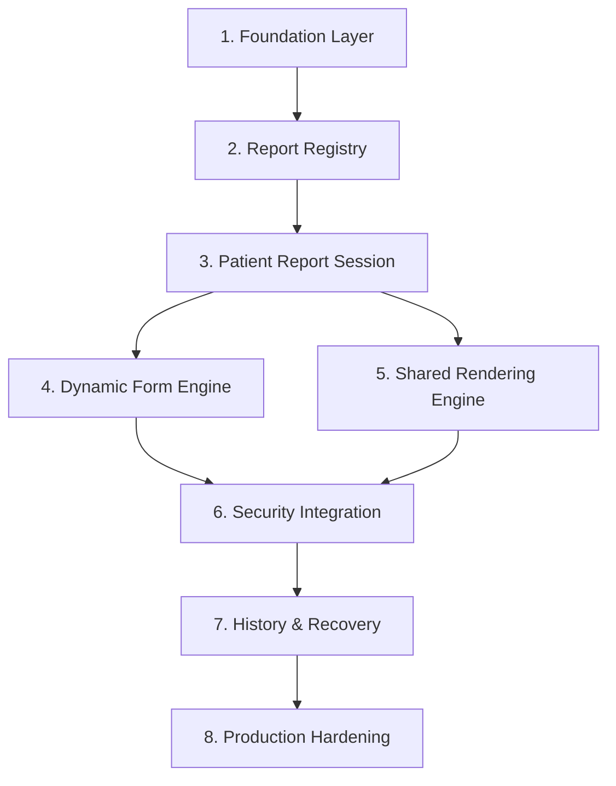

# St. Rose Laboratory Result Management System
## Software Implementation Guidelines & Engineering Standards

---

# 1. Purpose & Relationship to Frozen Architecture

This document serves as the official **Implementation Handbook** for software engineers and AI coding assistants building code for the **St. Rose Laboratory Result Management System**.

## 1.1 Relationship to Authority Baseline

This document is strictly **subordinate** to the frozen architecture baseline:

1. `PROJECT.md`
2. `LABORATORY_TEMPLATE_SPECIFICATION.md`
3. `Architecture/DOMAIN_MODEL.md` (FROZEN)
4. `Architecture/DATABASE_DESIGN.md` (FROZEN)
5. `Architecture/REPORT_REGISTRY_ARCHITECTURE.md` (FROZEN)
6. `Architecture/REPORT_RENDERING_ARCHITECTURE.md` (FROZEN)
7. `Architecture/UI_ARCHITECTURE.md` (FROZEN)
8. `Architecture/SECURITY_MODEL.md` (FROZEN)
9. `Architecture/DECISIONS.md` (FROZEN)

> **MANDATORY RULE**: This document translates frozen architectural contracts into practical coding standards. It **NEVER** redefines, replaces, or alters any frozen architectural decision.

---

# 2. Core Implementation Principles

1. **Architecture Compliance First**: Every pull request and code change must strictly satisfy the frozen architecture baseline. No unapproved features, database fields, or medical formulas may be added.
2. **Domain Layer Purity**: Domain models and business logic must remain pure JavaScript/TypeScript, completely decoupled from Next.js, React, or Supabase SDK abstractions.
3. **Strict Type Safety**: TypeScript strict mode (`"strict": true`) must be enabled. The `any` type is strictly forbidden (`@typescript-eslint/no-explicit-any`).
4. **Single Source of Truth**: Template behavior originates from `ReportRegistryService`. Visual output originates from the `SharedRenderingEngine`.
5. **Zero Password Storage**: Identity credentials and passwords belong exclusively to Supabase Auth (`auth.users`). Application code must never handle or store raw password hashes.
6. **Defensive Error Handling**: API endpoints must return generic, sanitized error messages while logging detailed diagnostics to server logs.

---

# 3. Project Folder Organization & Naming Conventions

The codebase follows a modular, feature-based Next.js / TypeScript structure:

```
src/
├── app/                        # Next.js App Router Pages & API Routes
│   ├── (auth)/                 # Login & Authentication Routes
│   ├── (dashboard)/            # AppShell-Wrapped Application Routes
│   │   ├── dashboard/          # Executive Dashboard View
│   │   ├── workspace/          # Guided Session Encoding Workspace
│   │   ├── history/            # 30-Day Completed Report Directory
│   │   ├── users/              # Admin User Management
│   │   └── personnel/          # Admin Personnel Directory
│   └── api/                    # Server-Side API Handlers
├── domain/                     # Pure Business Domain Layer (Framework Agnostic)
│   ├── models/                 # Aggregates, Entities, Value Objects
│   ├── services/               # Pure Domain Calculations & Invariants
│   └── value-objects/          # Value Objects (PatientAge, SignatorySnapshot)
├── services/                   # Application Services & Registry Orchestrators
│   ├── report-registry.ts      # Report Registry Metadata Service
│   ├── reference-evaluator.ts  # Reference Range Evaluation Engine
│   └── auto-suggestion.ts      # Physician/Referrer Learning Service
├── repositories/               # Data Access Layer (Supabase Mappers)
│   ├── session-repository.ts   # Session Aggregate Persistence
│   ├── personnel-repository.ts # Personnel Directory Data Access
│   └── user-repository.ts      # User Profile Data Access
├── rendering/                  # Shared Rendering Engine & Layout Adapters
│   ├── engine.ts               # Shared Render Engine Entry Point
│   ├── families/               # Tabular, Simple, Grid, Narrative Engines
│   └── adapters/               # Preview, Print, and PDF Output Adapters
├── features/                   # UI Modules & Interactive View Components
│   ├── workspace/              # Guided Workspace Form Controls & Toolbars
│   ├── history/                # History Table & Retention Countdown
│   ├── users/                  # User Account Management Modals & Tables
│   └── personnel/              # Personnel Maintenance & Signature Upload
└── components/                 # Shared UI Components (Design System Tokens)
    ├── ui/                     # Input, Select, Table, Modal, Button
    └── layout/                 # AppShell, Header, Sidebar
```

## 3.1 Naming Conventions

- **React Components**: `PascalCase.tsx` (e.g., `PatientSummaryHeader.tsx`, `UserManagementView.tsx`).
- **TypeScript Modules**: `kebab-case.ts` (e.g., `report-registry-service.ts`, `patient-report-session.ts`).
- **Types & Interfaces**: `PascalCase` (e.g., `PatientReportSession`, `ReportTemplateSpec`).
- **Functions & Variables**: `camelCase` (e.g., `calculateExpirationDate`, `validateSignatoryCount`).
- **Database Tables & Columns**: `snake_case` (e.g., `patient_report_sessions`, `printed_prc_license_number`).

---

# 4. Implementation Sequence & Phase Roadmap

Implementation must follow an explicit, dependency-ordered sequence:



## 4.1 Phase Breakdown

### Phase 1: Foundation
- **Objective**: Establish core TypeScript types, database client initialization, pure domain interfaces, and shared design system tokens.
- **Dependencies**: None.
- **Expected Deliverables**: Core domain models, Supabase client initialization, shared UI component primitives (`Input`, `Select`, `Table`, `Modal`, `Button`, `AppShell`).

### Phase 2: Report Registry
- **Objective**: Implement `ReportRegistryService` to load, cache, and serve static template metadata (`report_templates`, `template_parameters`).
- **Dependencies**: Phase 1 Foundation, Database Schema.
- **Expected Deliverables**: Hydrated `ReportRegistryService`, metadata cache layer, unit tests for parameter resolution and unit mappings across all 17 templates.

### Phase 3: Patient Report Session
- **Objective**: Implement `PatientReportSession` aggregate root, session repositories, shared demographics handling, and state transition logic.
- **Dependencies**: Phase 1 Foundation, Phase 2 Report Registry.
- **Expected Deliverables**: Domain session models, persistence repositories, `AutoSuggestionLearningService` triggered upon session completion.

### Phase 4: Dynamic Form Engine
- **Objective**: Build guided workspace UI and metadata-driven form controls (`NumericText`, `FreeText`, `SingleSelect`, `Combobox`, `Computed`, `is_selected` toggle, Urinalysis crystal dropdown, kit info, remarks).
- **Dependencies**: Phase 2 Report Registry, Phase 3 Patient Report Session.
- **Expected Deliverables**: Guided encoding workspace, dynamic form controls, real-time reference evaluator warnings, keyboard shortcuts, navigation guards.

### Phase 5: Shared Rendering Engine
- **Objective**: Implement `SharedRenderingEngine` and four Renderer Family layout engines (`Tabular`, `SimpleResult`, `DiagnosticGrid`, `NarrativeCertificate`) feeding Screen Preview Target, Browser Print Target, and PDF Output Adapter.
- **Dependencies**: Phase 2 Report Registry, Phase 3 Patient Report Session.
- **Expected Deliverables**: Shared render engine, A4 paper boundary layout, signature PNG rendering, preview modal, print stylesheet, PDF output adapter.

### Phase 6: Security Integration
- **Objective**: Wire Supabase Auth authentication, active status checks (`status = 'Active'`), `Admin`-only route protection for `/users` and `/personnel`, signature storage protection, and RLS policies.
- **Dependencies**: Phase 3 Patient Report Session, Repositories, Database Schema.
- **Expected Deliverables**: Auth middleware, protected API endpoints, non-public signature storage proxy, active status verification.

### Phase 7: History & Recovery
- **Objective**: Build completed session history directory (`/history`), 30-day retention countdown, report replacement workflow, and draft auto-save recovery.
- **Dependencies**: Phase 3 Patient Report Session, Phase 5 Rendering Engine, Phase 6 Security Integration.
- **Expected Deliverables**: History directory table, report replacement workflow, automated retention purge cron trigger, draft recovery banner.

### Phase 8: Production Hardening
- **Objective**: Execute static analysis, strict type checking, integration testing, error logging sanitization, and production build optimization.
- **Dependencies**: All Previous Phases (1 through 7).
- **Expected Deliverables**: Clean `npx tsc --noEmit`, clean `npm run lint`, 100% passing test suite, successful `npx next build`.

---

# 5. Layer-Specific Implementation Guidelines

## 5.1 Domain Layer Guidelines (`src/domain/`)
- Must contain zero imports from `react`, `next`, or `@supabase/supabase-js`.
- Express domain entities as TypeScript classes or immutable interfaces.
- Enforce invariants inside domain entity methods (e.g., `session.completeSession()`).

## 5.2 Application Service Layer Guidelines (`src/services/`)
- Encapsulates multi-repository orchestrations and registry metadata lookups.
- Executes `ReferenceEvaluationService` to grade results without mutating persistent state.

## 5.3 Repository Layer Guidelines (`src/repositories/`)
- Maps Supabase database rows (`snake_case`) to domain entities (`camelCase`).
- Handles historical snapshot freezing into `report_signatories` and `laboratory_results` during session completion.

## 5.4 Validation Guidelines
- Server-side request validation using strict schema validators (e.g., Zod).
- UI validation provides immediate inline feedback while relying on server validation for final execution.

---

# 6. Subsystem Implementation Rules

## 6.1 Report Registry Implementation Rules
- Query registry metadata dynamically via `ReportRegistryService`.
- Cache metadata in memory to minimize database roundtrips.
- **NEVER** hardcode template parameters, dropdown choices, or units in React components.

## 6.2 Dynamic Form Implementation Rules
- Generate form inputs dynamically from registry `inputType` specifications (`NumericText`, `FreeText`, `SingleSelect`, `Combobox`, `Computed`).
- **Scrub Deselected Parameters**: Parameters with `is_selected = false` must be stripped before persistence and omitted from report output trees.

## 6.3 Rendering Implementation Rules
- Route Screen Preview, Browser Print, and PDF Export through the single `SharedRenderingEngine`.
- Enforce physical A4 dimensions (`210mm x 297mm`) with `15mm` margins.
- Apply `break-after: page;` between selected test reports; suppress on the final page.

## 6.4 Security Implementation Rules
- Enforce JWT authentication and `status = 'Active'` checks on every server API route.
- Restrict `/users` and `/personnel` API routes to `role = 'Admin'`.
- Serve Pathologist signature images via authenticated API proxy routes or short-lived token-gated URLs.

---

# 7. Engineering Standards & Quality Assurance

## 7.1 Error Handling & Logging Conventions
- API error responses return generic messages (`"Unable to complete session"`).
- Detailed error tracebacks are logged strictly to server-side logging systems.

## 7.2 Testing Expectations
- **Unit Tests**: Mandatory coverage for domain entities, reference range evaluators, and computed parameter formulas using standard test runners.
- **Integration Tests**: Coverage for `ReportRegistryService` metadata hydration and `SharedRenderingEngine` HTML document generation.

## 7.3 Performance Considerations
- Cache Pathologist PNG signatures and logo assets.
- Enable fast numeric entry shortcuts (`Enter`/`Down Arrow`) in the encoding workspace.

## 7.4 AI-Assisted Development Rules
AI coding assistants working on this repository must adhere to the following:
1. **Consult Architecture Baseline**: Read relevant frozen architecture documents before generating code.
2. **No Unapproved Modifications**: Never invent features, calculations, database columns, or visual layout changes.
3. **Verify Empirical Success**: Always run static analysis (`npx tsc --noEmit`) and build checks to verify code correctness before declaring completion.

---

# 8. Definition of Done (DoD) for Implementation Tasks

An implementation task is considered **DONE** only when all of the following criteria are met:

1. ✅ **Architecture Baseline Compliance**: Verified 100% compliant with all 9 frozen architecture documents.
2. ✅ **TypeScript Compilation**: `npx tsc --noEmit` passes with **0 errors**.
3. ✅ **Linting & Code Style**: `npm run lint` passes with **0 warnings and 0 errors**.
4. ✅ **Automated Tests**: Unit and integration tests pass cleanly.
5. ✅ **Empirical Verification**: Runtime build (`npx next build` or test command) completes with clean exit code `0`.
