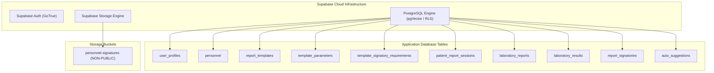
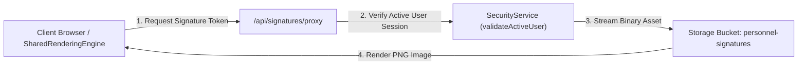
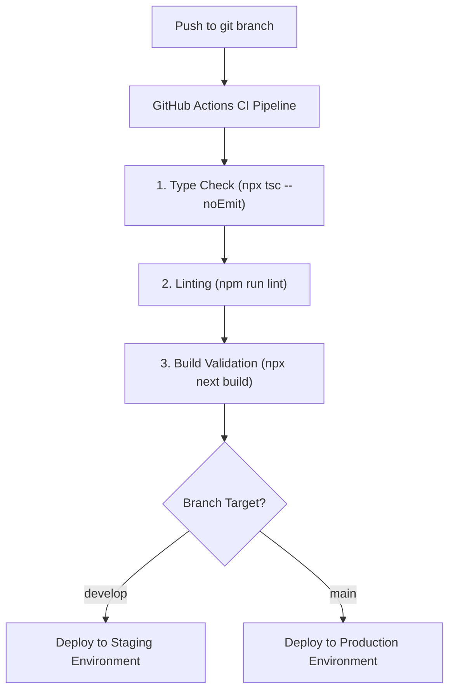

# Production Deployment Architecture

- **Status**: Architecturally Frozen & Approved Specification
- **Author**: Master Developer Col / AI Pair Programmer
- **Date**: 2026-08-08
- **Context**: St. Rose Laboratory Result Management System Deployment & Infrastructure Specification

---

# 1. Purpose & Overview

This document specifies the official production deployment architecture, environment configuration, database migration protocol, secret management strategy, and monitoring standards for the St. Rose Laboratory Result Management System.

---

# 2. Environment Strategy

The system enforces a strict 3-tier deployment environment model:

| Environment | Purpose | Database Target | Deployment Target |
|---|---|---|---|
| **Development** | Local feature implementation & testing | Local Supabase Docker / Dev Project | `localhost:3000` |
| **Staging** | Pre-release validation & client review | Supabase Staging Tenant | Vercel Staging Environment |
| **Production** | Live clinical operation | Supabase Production Tenant | Vercel Production Deployment |

## 2.1 Configuration Matrix Across Environments

| Feature / Setting | Development | Staging | Production |
|---|---|---|---|
| **Database RLS** | Enabled & Enforced | Enabled & Enforced | Enabled & Enforced |
| **Storage Bucket** | Local Mock / Staging Bucket | Protected (`personnel-signatures`) | Protected (`personnel-signatures`) |
| **Auth Provider** | Mock / Supabase Auth Dev | Supabase Auth (Staging Tenant) | Supabase Auth (Production Tenant) |
| **Branch Target** | Feature Branches (`feature/*`) | `develop` Branch | `main` Branch |

## 2.2 Infrastructure Region & Operational Location

### 2.2.1 Operational Location & Primary User Base
- **Laboratory Facility**: St. Rose Diagnostic Laboratory
- **Physical Address**: 18 Lourdes St., Brgy. La Fuente, Santa Rosa, Nueva Ecija, Philippines
- **Primary User Base**: Laboratory Administrators, Pathologists, Medical Technologists, Receptionists, and Patients of St. Rose Diagnostic Laboratory.

### 2.2.2 Infrastructure Region Selection
Production infrastructure deployment regions are selected to provide low-latency network connectivity and reliable service execution for users operating from Santa Rosa, Nueva Ecija, Philippines.

| Component / Platform | Deployment Region | Location | Operational Rationale |
|---|---|---|---|
| **Supabase Project** | Singapore | Southeast Asia | Selected deployment region to provide low-latency connectivity for the laboratory's operational location in the Philippines. |
| **Vercel Deployment** | Singapore | Southeast Asia | Selected compute region for Next.js application edge/serverless services to align with backend database services and provide low-latency access for clinical users. |

Co-locating database storage and compute infrastructure in Singapore minimizes inter-service network latency during clinical workflow execution, patient registration, laboratory result encoding, report generation, and PDF document retrieval.

### 2.2.3 Deployment Principles
- **Operational Proximity**: Production infrastructure shall be deployed as close as practical to the laboratory's operational location in the Philippines.
- **Regional Consistency**: Application compute services and the primary database should remain within the same deployment region whenever practical to minimize inter-service latency, simplify operations, and improve overall system reliability.
- **Service Standards**: Infrastructure decisions shall prioritize reliability, security, availability, maintainability, and low-latency access.
- **Workflow Optimization**: The deployment architecture is optimized for patient registration, laboratory result encoding, report generation, and report retrieval during high-volume shift operations.

---

# 3. Supabase Project & Infrastructure Structure

---

# 4. Environment Variables & Secret Management

## 4.1 Required Environment Variables Matrix

| Variable Name | Environment Scope | Exposure | Purpose & Description |
|---|---|---|---|
| `NEXT_PUBLIC_SUPABASE_URL` | All | Public (Client) | Supabase API endpoint URL. |
| `NEXT_PUBLIC_SUPABASE_ANON_KEY` | All | Public (Client) | Supabase anonymous API key for client-side queries. |
| `SUPABASE_SERVICE_ROLE_KEY` | Server-Only | Secret (Private) | Supabase service role key for administrative system tasks. **NEVER expose to client.** |
| `NEXT_PUBLIC_APP_ENV` | All | Public (Client) | Execution environment string (`development`, `staging`, `production`). |
| `SIGNATURE_TOKEN_SECRET` | Server-Only | Secret (Private) | Secret key for signing time-limited signature access proxy tokens. |

## 4.2 Secret Security Principles

1. **Zero Client Secret Exposure**: `SUPABASE_SERVICE_ROLE_KEY` and `SIGNATURE_TOKEN_SECRET` must **never** be prefixed with `NEXT_PUBLIC_` and must be accessed exclusively in server-side API routes or Server Components.
2. **Environment Variable Injection**: Environment variables are injected at deployment time via secret managers (Vercel Environment Variables / GitHub Secrets).

---

# 5. Storage Buckets & Access Control Model

Pathologist signature PNG images are legal medical assets and are protected by strict storage access controls:

## 5.1 Storage Bucket Configuration

- **Bucket Name**: `personnel-signatures`
- **Public Visibility**: `FALSE` (Private Storage Bucket)
- **Allowed MIME Types**: `image/png`
- **Max File Size**: `2 MB`

## 5.2 Storage Access & Delivery Mechanism

- Unauthenticated HTTP requests directly to signature asset URLs are **blocked**.
- Assets are delivered exclusively through the **authenticated private proxy** endpoint
  (`/api/signatures/proxy?path=...`). **There is no custom access token and no HMAC.** The endpoint
  authenticates the application session and admits only `Admin` and `User`, matching report visibility;
  it then proves the requested object path is referenced by either the current
  `personnel.signature_image_url` or a frozen `report_signatories.signature_image_url` before streaming
  the bytes with the server-only credential. This matches the §5.2 diagram above, which has always shown
  session verification. Superseded wording describing a `&token=` query parameter referred to an earlier
  unsigned, forgeable token that was **removed** in the P3 signature slice (2026-08-19).

---

# 6. Database Migration Workflow

All database schema changes follow an imperative, sequential 5-migration workflow.

## 6.1 Approved 5-Migration Architecture

Migrations are stored under `supabase/migrations/` using standard sequential ordering:

- `supabase/migrations/01_extensions_and_functions.sql`: PostgreSQL extensions (`uuid-ossp`, `pgcrypto`) and trigger helper functions (`update_updated_at_column`).
- `supabase/migrations/02_tables.sql`: DDLs for all 10 core application tables (`user_profiles`, `personnel`, `report_templates`, `template_parameters`, `template_signatory_requirements`, `patient_report_sessions`, `laboratory_reports`, `laboratory_results`, `report_signatories`, `auto_suggestions`).
- `supabase/migrations/03_indexes_and_triggers.sql`: Foreign key indexes, performance optimization indexes, and `updated_at` automated triggers.
- `supabase/migrations/04_report_registry_seed.sql`: Authoritative reconciled seed data for all 17 templates (65 template parameters).
- `supabase/migrations/05_rls_policies.sql`: Row-Level Security policies enforcing role-based access for `Admin`, `Pathologist`, `MedicalTechnologist`, and `Receptionist`.

## 6.2 Migration Execution Protocol

1. **Local Test**: Run `npx supabase db reset` to apply all five migrations sequentially.
2. **Staging Migration**: Apply via Supabase CLI: `npx supabase db push --linked`.
3. **Production Migration**: Apply during scheduled maintenance window via Supabase CLI with migration status verification.

---

# 7. Deployment Workflow (CI/CD Pipeline)

Deployments are automated via GitHub Actions:

---

# 8. Backup & Restore Strategy

## 8.1 Automated Database Backups

- **Daily Point-in-Time Recovery (PITR)**: Supabase automated daily database backups with 7-day retention for Staging and 30-day retention for Production.
- **Pre-Migration Backups**: Manual logical export (`npx supabase db dump`) executed before running any schema migration on production.

## 8.2 Disaster Recovery Procedure

1. **Database Restoration**: Restore database instance from the latest clean PITR snapshot via Supabase Console.
2. **Storage Synchronization**: Re-sync signature PNG storage assets from non-public backup archive.
3. **Verification**: Execute `StartupValidationService` to confirm database connectivity, active user authentication, and 17-template registry loading.

---

# 9. Monitoring, Logging & Alerting

- **Application Logs**: Standardized server-side error logging captured via Next.js runtime log streams.
- **Audit Logging**: Mandatory security events logged to `AuditLogService` (viewable via `/audit` route).
- **Health Checks (`/api/health`)**: Specified as a **Pending Implementation** for live Supabase integration (will periodically check database connectivity, RLS status, and active metadata template counts).

---

# 10. Failure Recovery & Rollback Procedure

## 10.1 Rollback Protocol

If a production deployment fails validation or exhibits critical operational defects:

1. **Vercel Instant Rollback**: Revert deployment alias to the previous stable build deployment hash (< 1 minute).
2. **Database Schema Rollback**: If migration failed, revert using compensating down-migration script or restore PITR snapshot.
3. **Post-Rollback Audit**: Log Incident Entry in `AuditLogService` detailing root cause, affected scope, and resolution timestamp.
