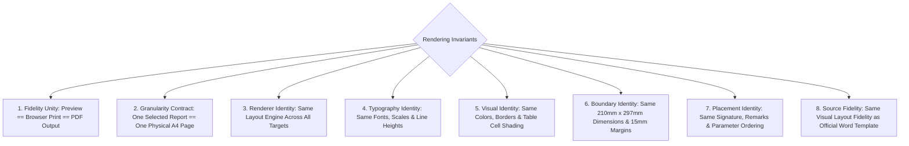
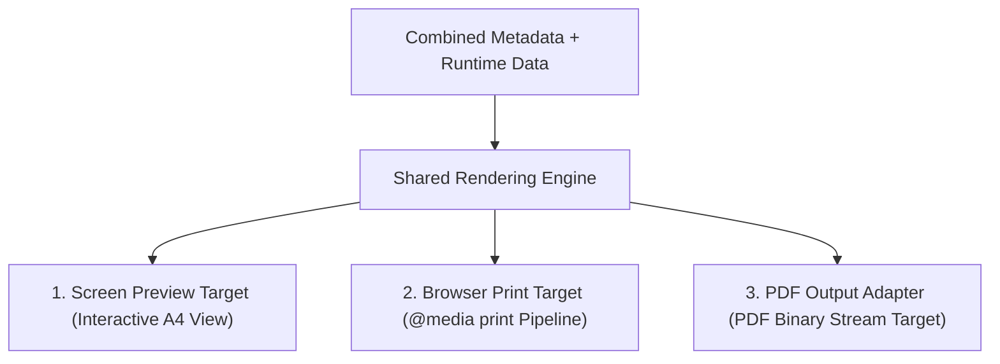
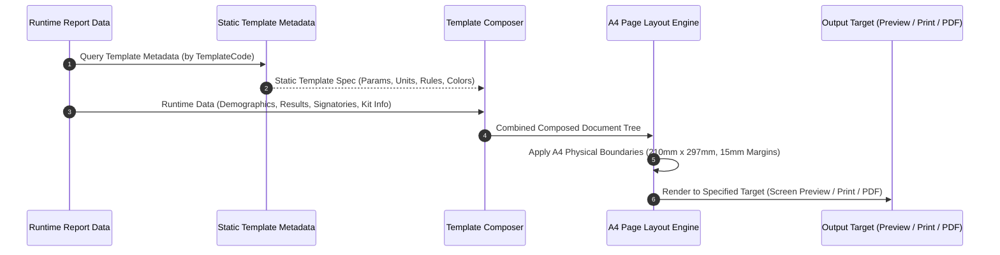

# St. Rose Laboratory Result Management System
## Report Rendering Architecture Specification

---

# 1. Purpose & Architectural Status

This document defines the official **Report Rendering Architecture Specification** for the **St. Rose Laboratory Result Management System**.

It specifies the end-to-end rendering pipeline, rendering inputs, shared rendering engine, rendering invariants, renderer families, physical A4 page layout rules, typography/style preservation mechanisms, signature positioning, and output target formatting across **Screen Preview**, **Browser Print**, and **PDF Output**.

## 1.1 Authority Hierarchy Alignment

This document operates strictly within the project authority hierarchy:

1. **PROJECT.md**: Authoritative source for project vision, milestone roadmaps, technology stack, and system-wide business rules.
2. **LABORATORY_TEMPLATE_SPECIFICATION.md**: Authoritative specification for official laboratory report templates, parameter definitions, reference rules, signatories, and renderer behavior.
3. **Architecture/DOMAIN_MODEL.md (FROZEN)**: Authoritative business domain specification defining entities, aggregate roots, value objects, domain services, lifecycles, and business invariants.
4. **Architecture/DATABASE_DESIGN.md (FROZEN)**: Authoritative relational database architecture and schema specification.
5. **Architecture/REPORT_REGISTRY_ARCHITECTURE.md (FROZEN)**: Authoritative Report Registry metadata specification.
6. **Current Source Code**: Contextual reference only. Code never overrides architecture specifications.

---

# 2. Rendering Inputs: Metadata vs. Runtime Data

The Report Renderer operates by combining two distinct, explicit input sources:

```mermaid
graph TD
    subgraph "Input Source 1: Static Template Metadata (Report Registry)"
        TemplateMeta["Template Metadata"]
        ParamDefs["Parameter Definitions & Display Order"]
        UnitsMeta["Units & Display Suffixes"]
        FamilyMeta["Renderer Family Classification"]
        ColorMeta["Template Color Palette"]
        SignatoryMeta["Signatory Requirements"]
        LayoutMeta["Layout Configuration Rules"]
    end

    subgraph "Input Source 2: Runtime Report Data (Patient Report Session)"
        Demographics["Patient Demographics (Shared)"]
        Results["Encoded Laboratory Results"]
        SelectedFlags["Selected Parameters & Reports"]
        RemarksData["Encoded Remarks / Footer Notes"]
        KitData["Laboratory Kit / Reagent Information"]
        SignatoriesData["Assigned Signatories & Historical Snapshots"]
    end

    subgraph "Report Rendering Engine"
        Composer["Template Composer & Layout Pipeline"]
        A4Engine["A4 Document Layout Engine"]
    end

    TemplateMeta --> Composer
    ParamDefs --> Composer
    UnitsMeta --> Composer
    FamilyMeta --> Composer
    ColorMeta --> Composer
    SignatoryMeta --> Composer
    LayoutMeta --> Composer

    Demographics --> Composer
    Results --> Composer
    SelectedFlags --> Composer
    RemarksData --> Composer
    KitData --> Composer
    SignatoriesData --> Composer

    Composer --> A4Engine
    A4Engine --> Targets["Output Rendering Targets (Preview / Print / PDF)"]
```

## 2.1 Input Source Breakdown

1. **Static Template Metadata (from the Report Registry)**:
   - Template Code & Title
   - Parameter Definitions & Default Display Ordering
   - Display Units & Suffixes (`g/dL`, `mmol/L`, `%`, `/HPF`, etc.)
   - Renderer Family Classification (`Tabular`, `SimpleResult`, `DiagnosticGrid`, `NarrativeCertificate`)
   - Template Color Palette
   - Signatory Requirement Counts
   - Remarks Support Flags & Default Remarks

2. **Runtime Report Data (from the Patient Report Session / Laboratory Report)**:
   - Shared Patient Demographics (Name, Age, Sex, Address, Status, Physician, Date)
   - Encoded Parameter Results & Reference Evaluation Snapshots
   - Selected Parameter Flags (`is_selected = true`)
   - Encoded Remarks & Custom Notes
   - Laboratory Kit Information (Kit Brand, Lot Number, Expiration Date)
   - Assigned Signatories & Frozen Credential Snapshots (Full Name, Credentials, License Number, Signature Image Reference)

The Report Renderer combines these two sources into a unified document structure. It does not render directly from the Report Registry alone.

---

# 3. Rendering Invariants

The Report Rendering Architecture enforces a set of strict **Rendering Invariants**. These invariants represent non-negotiable architectural contracts:

> **CRITICAL ARCHITECTURAL CONTRACT**: Any violation of these rendering invariants across Screen Preview, Browser Print, or PDF Output is classified as an architectural rendering defect.

## 3.1 Detail of Invariant Specifications

1. **Fidelity Unity**: `Preview == Browser Print == PDF Output`. The visual output across all three target channels must be indistinguishable.
2. **Granularity Contract**: `One Selected Laboratory Report == One Physical A4 Page`. Every selected examination in a session produces exactly one independent A4 page.
3. **Renderer Identity**: The exact same `RendererFamily` layout logic renders Preview, Print, and PDF.
4. **Typography Identity**: Identical font families, font sizes, font weights, and line heights across all output channels.
5. **Visual Identity**: Identical template color palettes, table gridlines, double-lines, and header cell shading across all output channels.
6. **Boundary Identity**: Identical physical page constraints (`210mm x 297mm` portrait A4 with `15mm` margins).
7. **Placement Identity**: Identical positioning for logo headers, demographics blocks, parameter ordering, remarks footers, and signatory lines.
8. **Source Fidelity**: Identical visual layout fidelity as the official Microsoft Word templates.

---

# 4. Single Source of Fidelity: Shared Rendering Engine

To guarantee compliance with **Rendering Invariant 1 (Fidelity Unity)**, the system uses a single **Shared Rendering Engine**:

By routing all three output targets through the identical rendering engine, visual drift is eliminated. What the user views in Screen Preview is guaranteed to match Browser Print and generated PDF files.

---

# 5. Output Target Architectures

The rendering engine targets three architecture-neutral output targets:

## 5.1 Screen Preview Target
- Renders an interactive preview within the application viewport.
- Displays an A4 paper simulation with scaling controls (`100%`, `Fit Screen`) and page navigation.
- Uses identical layout markup as the print engine.

## 5.2 Browser Print Target
- Formats output for browser print drivers via media-specific style rules.
- Suppresses application UI navigation, sidebars, and action toolbars.
- Forces exact color preservation (`print-color-adjust: exact`).
- Enforces strict page break separation between multi-test report pages.

## 5.3 PDF Output Adapter
- Receives the formatted document layout tree from the shared rendering engine.
- Generates a standalone, binary PDF document matching physical A4 paper dimensions (`210mm x 297mm`).
- Preserves embedded PNG signature images, vector borders, and font metrics with zero layout distortion.

---

# 6. End-to-End Rendering Pipeline

The rendering pipeline processes input sources through five sequential phases:

## 6.1 Pipeline Phase Breakdown

1. **Ingestion Phase**: Receives static template metadata from the Report Registry and runtime report data from the Patient Report Session.
2. **Omission Phase**: Filters out unselected reports (`is_selected = false`) and unselected/blank optional parameters. Only active, selected items enter composition.
3. **Composition Phase**: Merges static metadata and runtime data into structural document blocks:
   - **Header Block**: Logo emblem, official lab title, address, contact details.
   - **Demographics Block**: Shared patient information (Name, Age, Sex, Physician, Date, etc.).
   - **Reagent Kit Block**: (If `requires_kit_info = TRUE`) Kit Name, Lot Number, Expiration Date.
   - **Body / Results Block**: Parameter results rendered by assigned `RendererFamily`.
   - **Remarks Block**: Optional footer notes and standard template remarks.
   - **Signatory Block**: Pathologist and Medical Technologist signature lines, PRC license numbers, credentials, and PNG signature images.
4. **Physical Layout Phase**: Enforces physical A4 dimensions (`210mm x 297mm`), `15mm` margins, table column width percentages, and line heights.
5. **Target Delivery Phase**: Dispatches composed document tree to Screen Preview Target, Browser Print Target, or PDF Output Adapter.

---

# 7. Renderer Families & Layout Composition

Every report template is rendered by its assigned **Renderer Family** layout engine:

| Renderer Family | Layout Composition Strategy | Assigned Laboratory Templates |
|---|---|---|
| **Tabular Report Family** | Multi-column structured data tables with exact column width percentages for Parameter, Result, Unit, and Reference Range. | `CBC`, `CHEM_8`, `CHEM_10`, `HDL_LDL`, `OGTT`, `ESR`, `CT_BT` |
| **Simple Result Family** | Focused single/dual-result card layouts with centered outcome statements and prominent diagnostic text. | `BLOOD_TYPING`, `RBS`, `HBA1C`, `HBSAG`, `RPR`, `PREG_TEST`, `DENGUE_DUO` |
| **Diagnostic Grid Family** | Multi-section grid dividing physical, chemical, and microscopic examination findings into bordered sub-tables. | `URINALYSIS`, `FECALYSIS` |
| **Narrative Certificate Family** | Formal narrative certificate layout with legal certification paragraphs, confidential headers, and multi-signatory blocks. | `HIV_RESULT` |

---

# 8. Physical A4 Page Boundaries & Visual Fidelity Rules

## 8.1 Physical A4 Page Specifications

- **Page Dimensions**: A4 Portrait (`210mm x 297mm`)
- **Page Margins**: `15mm` Top, Bottom, Left, Right
- **Page Break Rule**: `One Selected Report == One Physical A4 Page`. Enforces `break-after: page;` between sequential report pages. The final page suppresses `break-after` to prevent trailing blank pages.

## 8.2 Typography & Style Rules

- **Font Hierarchy**: Strict font size scaling matching official Word templates (14pt-16pt Headers, 10pt-11pt Results, 9pt-10pt Demographics/Table Headers, 8.5pt Credentials).
- **Table Gridlines & Borders**: Solid `1px` or double-line borders matching template specifications.
- **Color Preservation**: Template-specific color palettes from static metadata apply to headers and shading. **Application UI branding never overrides report colors.**

---

# 9. Signature & Remarks Placement Architecture

## 9.1 Signatory Layout Architectures

- **Standard 2-Signatory Block (16 Templates)**: Medical Technologist (Left), Pathologist (Right).
- **HIV 3-Signatory Block (`HIV_RESULT`)**: Medical Technologist 1 (Left - Performed By), Medical Technologist 2 (Center - Verified By), Pathologist (Right - Approved By).

## 9.2 Pathologist PNG Signature Image Rendering

- Rendered with transparent background overlapping Pathologist name line.
- Preserves natural aspect ratio without distortion.
- **Fallback Rule**: If PNG signature is unavailable, render printed name, credentials, and PRC license number only. **NEVER substitute handwritten script fonts.**

---

# 10. Architectural Consistency Verification Matrix

| Architecture Requirement / Invariant | Rendering Architecture Mapping | Status |
|---|---|---|
| **Dual Input Sources** | Static Metadata + Runtime Data combined by renderer | ✅ Pass |
| **Architecture-Neutral Targets** | Screen Preview Target, Browser Print Target, PDF Output Adapter | ✅ Pass |
| **Rendering Invariants** | Section 3 documents 8 non-negotiable invariants | ✅ Pass |
| **Fidelity Unity (Inv 1)** | Shared rendering engine feeds all output targets | ✅ Pass |
| **One Test = One Page (Inv 2)** | `break-after: page;` enforced per selected test | ✅ Pass |
| **HIV 3-Signatory Layout** | `HIV_RESULT` renders 1 Pathologist + 2 MedTech blocks | ✅ Pass |
| **OGTT Tabular Layout** | `OGTT` renders Fasting, 1hr, 2hr rows in Tabular family | ✅ Pass |
| **Color Preservation** | Report color palette independent of application UI branding | ✅ Pass |
| **PNG Signature Integrity** | Preserves aspect ratio & transparency; no script fonts | ✅ Pass |
| **Database & Registry Consistency**| Aligns 100% with frozen `DATABASE_DESIGN.md` & `REPORT_REGISTRY_ARCHITECTURE.md` | ✅ Pass |
