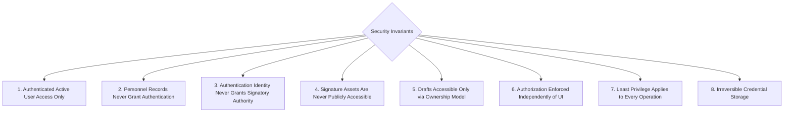
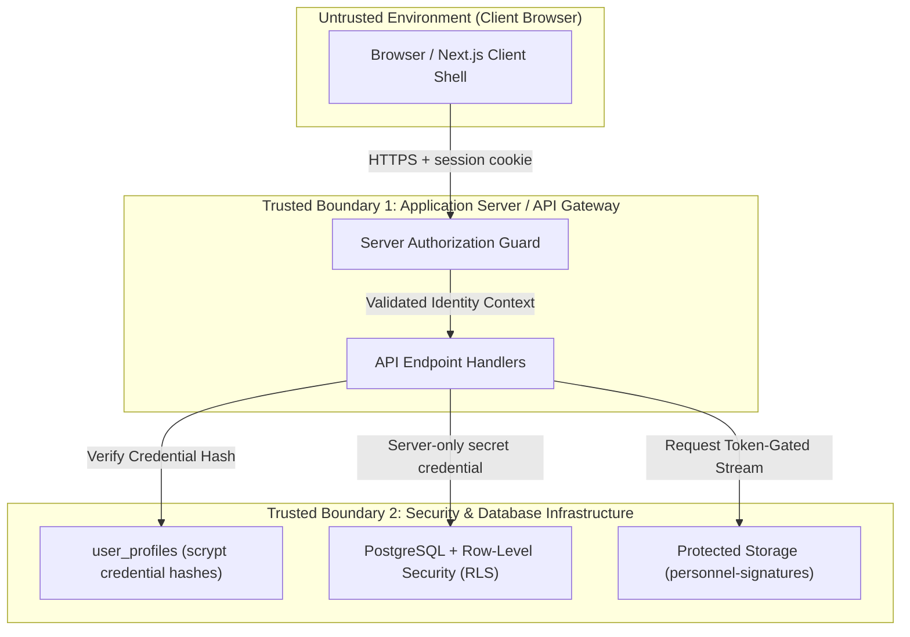
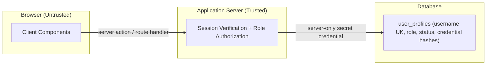
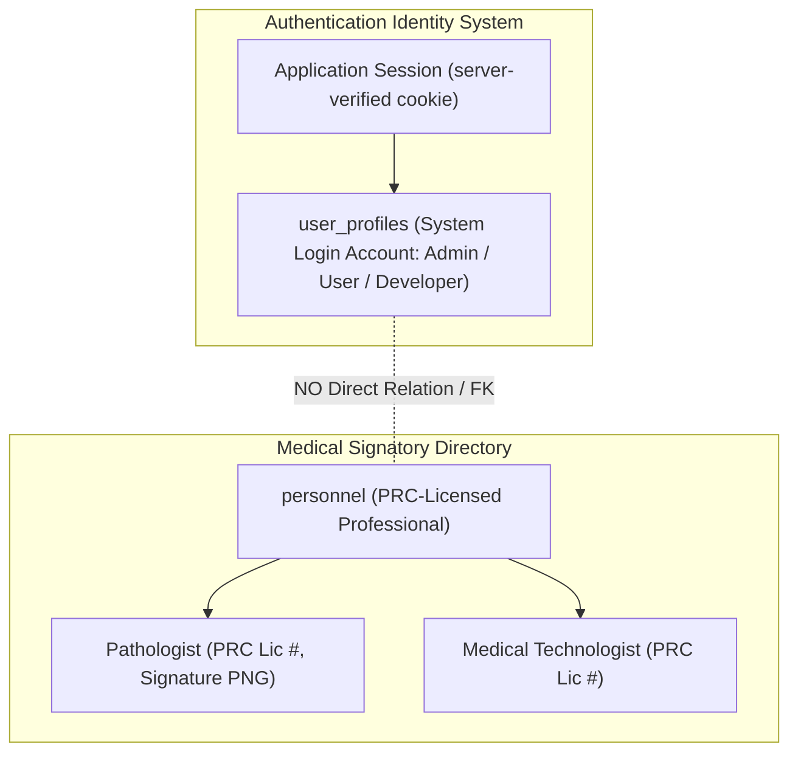

# St. Rose Laboratory Result Management System
## Security Model & Architecture Specification

---

# 1. Purpose & Architectural Status

This document defines the official **Security Model Specification** for the **St. Rose Laboratory Result Management System**.

It specifies the security architecture, threat model, trust boundaries, authentication responsibilities, role-based authorization (RBAC), authentication user vs. personnel decoupling, database-level security policies, signature storage protection, mandatory audit logging requirements, and information disclosure defenses.

## 1.1 Authority Hierarchy Alignment

This document operates strictly within the project authority hierarchy:

1. **PROJECT.md**: Authoritative source for project vision, milestone roadmaps, technology stack, and system-wide business rules.
2. **LABORATORY_TEMPLATE_SPECIFICATION.md**: Authoritative specification for official laboratory report templates, parameter definitions, reference rules, signatories, and renderer behavior.
3. **Architecture/DOMAIN_MODEL.md (FROZEN)**: Authoritative business domain specification defining entities, aggregate roots, value objects, domain services, lifecycles, and business invariants.
4. **Architecture/DATABASE_DESIGN.md (FROZEN)**: Authoritative relational database architecture and schema specification.
5. **Architecture/REPORT_REGISTRY_ARCHITECTURE.md (FROZEN)**: Authoritative Report Registry metadata specification.
6. **Architecture/REPORT_RENDERING_ARCHITECTURE.md (FROZEN)**: Authoritative Report Rendering architecture specification.
7. **Architecture/UI_ARCHITECTURE.md (FROZEN)**: Authoritative Application UI architecture specification.
8. **Current Source Code**: Contextual reference only. Code never overrides architecture specifications.

---

# 2. Security Principles & Goals

## 2.1 Security Principles

1. **Defense in Depth**: Security controls are enforced at multiple independent layers: Client Route Guards, Server API Authorization, and Database-Enforced Row-Level Security (RLS) policies.
2. **Principle of Least Privilege**: Users are granted minimum operational access required for their role. Non-administrative users cannot manage accounts or personnel master data.
3. **No Recoverable Credential Storage**: Authentication credentials and security-question answers are stored exclusively as salted one-way hashes produced by a memory-hard key derivation function. Plaintext passwords and plaintext recovery answers are never stored, logged, or transmitted to clients. No reversible form of either is retained.
4. **Strict Identity Decoupling**: Application login identities (`user_profiles`) and PRC-licensed medical professionals (`personnel`) are completely separate entities.
5. **Report & Signature Integrity**: Pathologist signature images are stored in protected storage with restricted access policies. Completed reports are protected against unauthorized modification.

## 2.2 Security Goals

- **Authentication Integrity**: Ensure only authorized, active laboratory staff can access the system.
- **Role Enforcement**: Restrict user management and personnel maintenance strictly to `Admin` users.
- **Data Protection**: Safeguard patient demographics, laboratory result data, and medical professional signature assets.
- **Auditability**: Define mandatory audit logging requirements for administrative actions, session submissions, and personnel updates.

---

# 3. Security Invariants

The Security Model defines eight non-negotiable **Security Invariants**. These invariants represent mandatory security contracts:

> **CRITICAL SECURITY CONTRACT**: Any code, API, or database change violating these invariants is an explicit security defect.

## 3.1 Detail of Security Invariant Specifications

1. **Authenticated Active User Access**: Only authenticated users with an active application account (`status = 'Active'`) may access protected system resources or database records.
2. **Personnel Record Isolation**: Personnel records (`personnel`) represent PRC-licensed medical professionals and **never** grant authentication or system login capability.
3. **Signatory Authority Isolation**: Authentication identities (`user_profiles`) represent system login accounts and **never** grant medical signatory authority on report outputs.
4. **Non-Public Signature Storage**: Signature assets in storage are non-public and **never** accessible via unauthenticated or direct public URLs.
5. **Draft Access Boundaries**: Drafts are accessible only according to active user session context and ownership rules.
6. **UI-Independent Authorization**: Security controls are enforced at the server boundary independently of client UI controls. Protected application data is accessed only from server code; browser clients hold no database credentials or privileges.
7. **Least Privilege Enforcement**: Non-administrative users are strictly prohibited from performing administrative operations regardless of API payload manipulation.
8. **Irreversible Credential Storage**: Credentials and security-question answers are stored only as salted one-way hashes. No plaintext or reversible form is persisted. Credential and recovery columns are readable exclusively by server-side authentication code, are excluded from every browser-reachable projection, and never appear in any API response.

---

# 4. Trust Boundaries & Threat Model

## 4.1 Trust Boundaries

## 4.2 Threat Model & Mitigation Matrix

| Threat Vector | Potential Impact | Architectural Defense |
|---|---|---|
| **Unauthorized System Access** | Unauthenticated user views patient data or generates reports | Identity provider authentication required for all routes/APIs. Real-time active status check rejects inactive accounts immediately. |
| **Privilege Escalation** | `User` role attempts to create admin accounts or edit personnel | Server authorization and database RLS policies enforce `role = 'Admin'` for write operations on `user_profiles` and `personnel`. |
| **Insecure Direct Object References (IDOR)** | User modifies another session by manipulating URL entity IDs | Database Row-Level Security (RLS) evaluates caller authorization context on every entity access. |
| **Sensitive Information Disclosure** | Leaking stack traces, internal errors, or unselected test data | Server sanitizes error responses. Deselected parameters (`is_selected = false`) are scrubbed before persistence. |
| **Signature Asset Leakage** | Direct public downloading or hotlinking of official signature PNGs | Storage bucket is **non-public**. Served only via authenticated API endpoints or temporary time-limited access tokens. |
| **Audit Log Tampering** | Malicious actor alters or erases security event history | Audit logging operates within an append-only boundary inaccessible to standard application queries. |
| **Session Misuse** | Revoked/deactivated staff member continues using active token | Every API request checks active user status (`status = 'Active'`). Deactivation revokes access instantly. |

---

# 5. Authentication Architecture (Application-Owned)

## 5.1 Identity, Credentials, and Trust Boundary

Authentication is application-owned. Supabase provides database and storage only; Supabase Auth is not used.

- **Identity**: `user_profiles` is the single authentication identity record, keyed by a unique `username`. No email address or phone number is collected or required.
- **Username canonicalization**: Usernames are canonicalized before storage and before every lookup: NFKC normalization, outer-whitespace trim, then locale-independent lowercasing. The canonical form is the stored and displayed form. Permitted characters are `a–z`, `0–9`, and the separators `.`, `_`, `-`; the value must begin and end with `a–z` or `0–9`, contain no consecutive separators, and be 3–50 characters long. Uniqueness is enforced on the canonical value, so `Admin` and `admin` are the same account and cannot both exist.
- **Credentials**: Passwords and security-question answers are stored as salted one-way scrypt hashes. The security question itself is stored in readable form; its answer is never recoverable.
- **Key derivation**: scrypt with `N=32768`, `r=8`, `p=1`, 32-byte derived key, and a 16-byte cryptographically random salt per record, independently generated for passwords and for recovery answers. `maxmem` is configured explicitly at 64 MiB; Node's 32 MiB default is insufficient for these parameters. Verification uses `timingSafeEqual`. Encoded form: `scrypt$N$r$p$<base64 salt>$<base64 hash>`.
- **Recovery answer normalization**: Answers are normalized identically before hashing and before verification — NFKC normalization, outer-whitespace trim, internal whitespace runs collapsed to a single space, then locale-independent lowercasing. Normalization affects whitespace and case only; punctuation and diacritics are never stripped.
- **Sessions**: Represented by an HMAC-signed, httpOnly, server-verified cookie. A `token_version` counter on `user_profiles` is embedded in the session payload; incrementing it invalidates all existing sessions for that account.
- **Trust boundary**: Every protected operation verifies the session server-side and resolves the caller's role and active status before any data access occurs. Client components call server actions or route handlers; they never query protected tables directly.
- **Recovery**: Username and security-question based. No email or phone recovery exists.
- **Decoupling Rule**: `user_profiles` maintains **zero connection** to `personnel`.

## 5.2 Password Management Operations

Three distinct password operations exist. They carry different actors, different proofs, and different authorization semantics, and they are never collapsed into a general account edit.

- **Authenticated self-service password change** *(approved 2026-08-14)*: the authenticated account changes its own password by supplying the current password, a new password, and a confirmation. The current password is the re-authentication proof for this sensitive operation and is verified server-side; the security question is **not** used. Available to `User`, `Admin`, and `Developer` alike. The acting account is resolved from the verified session and the persisted account record, never from request input, and the operation targets only that account. On success `token_version` increments — invalidating sessions issued to other devices — and the initiating session is re-issued carrying the new value.
- **Forgot-password recovery** *(unchanged)*: username, then the configured security-question challenge, then the answer, then a new password and confirmation. Anti-enumeration behaviour, recovery rate limiting, and staged `token_version` binding are preserved. The configured security question and its answer are retained after a successful reset; recovering a password does not clear them.
- **Privileged password reset** *(clarified)*: an authorized `Admin` or `Developer` resets another account's password. Authorization derives solely from the actor's persisted role and the account-management policies in §6. The target's security answer is **never** required — it belongs to the account owner for self-service recovery, and is not an administrator authorization factor. `Admin` has no ability to view or reset `Developer` accounts, per §6.4.

---

# 6. Authorization Model & Completed Report Authorization

The application enforces a 3-tier Role-Based Access Control (RBAC) model across all resources:

## 6.1 Role Definitions

- **`Admin`**: Full system administration access. Retains system-wide administrative authority to manage user accounts, toggle account active/inactive status, manage personnel directory, upload signature assets, create patient sessions, encode results, launch previews, print reports, and view history across all laboratory records.
- **`User`**: Clinical operational access. Can create patient sessions, encode results, manage drafts, replace completed reports within the allowed 30-day retention window, launch previews, print reports, and view history. Cannot access `/users` or `/personnel`.
- **`Developer`**: Technical monitoring and maintenance access — system health, database health and status, diagnostics, and audit/technical information. Least privilege applies: no user-management writes, no Personnel Directory writes, no routine patient or report operational access, and no routine Completed History access. Developer accounts may be created or granted only by an existing Developer; Admin cannot create or promote them.

## 6.2 Confirmed Rules for Completed Reports

1. **30-Day Retention Boundary**: Completed reports are retained for **30 days** (`expires_at = completed_at + 30 days`).
2. **Replacement within Retention**: Authorized users may reopen, preview, print, regenerate PDF, and replace the current report within the allowed 30-day retention period. Replacement is performed by re-completion: the session is reopened in an explicit Replacement Mode, revalidated through the existing completion pipeline, and a newly composed completion snapshot atomically replaces the current one. A frozen snapshot is never mutated or bypassed. The retention anchor is immutable: `expires_at` remains `original completed_at + 30 days` and is never restarted or extended by replacement. No version branching is introduced.
3. **No Version History**: There is **no version history** in the initial release (single-record replacement semantics).
4. **UI-Independent Authorization**: Authorization must be enforced outside the client UI (at both Server API and Database RLS layers).
5. **Immutability of Expired Reports**: Expired reports (`expires_at < NOW()`) cannot be edited or replaced under any circumstances.

> [!NOTE]
> **RESOLVED — Completed Report visibility.** `Admin` and `User` may retrieve all completed
> laboratory reports system-wide within the approved retention policy. No per-encoder ownership
> model is introduced. `Developer` does not receive routine Completed History access.

## 6.3 Authorization Matrix for Completed Reports

| Action on Completed Report | `User` Role | `Admin` Role | `Developer` Role | Enforcement Boundary & Condition |
|---|---|---|---|---|
| **View Completed Report** | Allowed (System-Wide) | Allowed (System-Wide) | **Denied** | Authenticated Active User required. |
| **Launch Preview** | Allowed (System-Wide) | Allowed (System-Wide) | **Denied** | Authenticated Active User required. Invokes shared rendering engine. |
| **Print Report** | Allowed (System-Wide) | Allowed (System-Wide) | **Denied** | Authenticated Active User required. Invokes print stream target. |
| **Export PDF** | Allowed (System-Wide) | Allowed (System-Wide) | **Denied** | Authenticated Active User required. Invokes PDF output adapter. |
| **Edit / Replace Report** | Allowed (System-Wide) | Allowed (System-Wide) | **Denied** | Allowed **only** within 30-day retention window (`original completed_at + 30 days`). Performed by re-completion. |
| **Edit Expired Report** | **Denied** | **Denied** | **Denied** | Immutability rule: Expired reports (`expires_at < NOW()`) cannot be edited. |

## 6.4 Developer Directory Visibility

`Developer` may read a restricted user directory exposing only `username`, `role`, and account `status`. This read is served exclusively through an authenticated server action or route handler that verifies the session, confirms the Developer role, and returns a restricted projection. The browser holds no direct database privilege on this data.

Developer has no access to credential or recovery fields, no password-reset controls, no account write operations, no Personnel Directory writes, and no routine patient or report access.

## 6.5 Initial Developer Bootstrap

The permanent rule stands: Admin cannot create or promote Developer accounts, and Developer grants remain specially protected.

A fresh database is provisioned with its first Developer account through a one-time operator procedure that is not exposed as application functionality:

- Executed directly against the server by an operator holding database access; no HTTP route, UI affordance, or application API performs it.
- Refuses to execute if any Developer account already exists.
- Temporary credentials are supplied at invocation through the process environment, never from source files, migrations, documentation, logs, or committed artifacts, and are never echoed.
- The created account carries `must_change_password = true` and `must_set_recovery = true`, so the operator's temporary credential cannot persist and the operator never learns the recovery answer.
- Execution is recorded as an audit event.

This creates no permanent Admin-to-Developer escalation path.

---

# 7. Separation of Authentication Users and Personnel

The system strictly enforces the separation of **Authentication Users** (`user_profiles`) and **Personnel** (`personnel`):

---

# 8. Database Security Strategy (Row-Level Security)

## 8.0 Authorization Boundary Under Application-Owned Authentication

Because authentication is application-owned rather than Supabase Auth, `auth.uid()` is not available to database policies. Authorization is layered:

1. **Authoritative layer — application server.** The server verifies the session cookie, resolves role and active status, and authorizes every operation. This is the authoritative boundary for all Admin / User / Developer decisions.
2. **Defensive layer — database permissions and RLS.** Grants and policies deny unauthorized direct access, particularly from browser or anon clients. They are defense-in-depth, not the per-user authorization mechanism.

Privileged server operations use a server-only Supabase secret credential that bypasses RLS. For those calls, RLS must not be represented as providing per-user authorization; the server boundary is authoritative. Policies written against `auth.uid()` are obsolete and must be superseded.

**Browser and anon access posture**: the anon role holds no SELECT or write privilege on any protected application table or view, including identity, personnel, session, report, audit, and directory data.

Database security is additionally enforced via PostgreSQL Row-Level Security (RLS) on the application tables:

## 8.1 Active Status Verification Requirement

All database RLS policies evaluate caller identity context and verify that the requesting account is active (`status = 'Active'`). If the account is inactive or unauthenticated, all database operations are denied.

## 8.2 Summary of Database RLS Boundaries

- **Browser / anon role**: no privilege on protected application tables or views.
- **Server privileged access**: performed with a server-only Supabase secret credential after the application server has verified the session and authorized the operation.
- **Administrative Write Operations**: authorized at the server boundary for active `Admin` accounts only, for `user_profiles`, `personnel`, and template configuration tables (`report_templates`, `template_parameters`, `template_signatory_requirements`).
- **Operational Write Operations**: authorized at the server boundary for active `Admin` and `User` accounts, for `patient_report_sessions`, `laboratory_reports`, `laboratory_results`, `report_signatories`, and `auto_suggestions`.
- **Audit records**: append-only; no application role holds UPDATE or DELETE privilege, and database-level enforcement rejects such operations regardless of credential.

---

# 9. Storage Security for Signature Assets

Pathologist PNG signature images represent sensitive legal medical assets:

- **Storage Bucket Boundary**: Stored in a **non-public** storage bucket (`personnel-signatures`).
- **Access Rule**: Direct unauthenticated HTTP downloads are blocked.
- **Delivery Mechanism**: Served exclusively via authenticated API proxy handlers or short-lived, time-limited token-gated access URLs.
- **Service Credential Handling**: The server-only Supabase secret credential (`SUPABASE_SECRET_KEY`) is the privileged server-side Data API credential. It is strictly server-only and must never appear in a `NEXT_PUBLIC_*` variable, a client-importable module, a client bundle, application logs, committed files, documentation, tests, migrations, or any prompt or message sent to an external service. It is used only after the application server has authenticated the session and authorized the operation.
- **Migration Credential Separation**: Schema migrations and DDL use the Supabase CLI or a direct database migration connection with operator-supplied credentials. The server-only secret credential is never used for DDL, and migration credentials never enter application environment configuration.

---

# 10. Mandatory Audit Logging Architecture Requirements

> [!IMPORTANT]
> The audit logging requirements defined below represent **security architecture requirements for software implementation**, not pre-existing or already implemented functionality.

Security-relevant operations across the system must be logged to an append-only audit boundary.

## 10.1 Mandated Audit Event Categories

1. **Authentication & Account Security Events**:
   - User account creation
   - User status changes (Active <-> Inactive)
   - User role modifications
   - Password reset requests
   - Security-question configuration or change
   - Recovery lookup attempts and answer verification failures
   - Password reset completion
   - Account lockout activation and release
   - Initial Developer bootstrap execution
2. **Personnel & Credential Events**:
   - Personnel record creation or modification
   - PRC license number updates
   - Pathologist PNG signature asset uploads or replacements
3. **Session Lifecycle & Report Events**:
   - Patient Report Session creation
   - Session completion & signatory snapshot freezing
   - Report replacement within the 30-day window
   - Automated retention purge execution
4. **Security Access & Denial Events**:
   - Unauthorized access attempts to administrative routes (`/users`, `/personnel`)
   - Failed authentication attempts
   - Direct signature asset access denials

## 10.2 Additional Approved Audit Events

The events in this section were approved on 2026-08-14 as project requirements **additional to §10.1**. They were not part of the original §10.1 mandate and must not be cited as such. The §10.1 obligations for failed authentication attempts and for account lockout activation and release are unaffected by this section and remain §10.1 requirements.

1. **Authentication Session Events**:
   - Successful authentication
   - Explicit user-initiated logout

Explicit logout means an authenticated account deliberately invoking the logout action. Passive session loss is **not** a logout and is never recorded as one: a missing, expired, malformed, or rejected session cookie, a `token_version` mismatch, and an account-deactivation rejection all fall outside this event.

These events follow the same classification and visibility rules as §10.1 events. Actor and target roles are resolved from the persisted account record, never from client input, and Developer-involved events remain visible to `Developer` readers and hidden from `Admin` readers.

## 10.5 Accepted Residual Risk — Recovery Question Disclosure

The approved recovery workflow displays an account's security question after username entry, which confirms account existence. This is intrinsic to the client-approved workflow. Mitigations: per-username and per-IP rate limiting, progressive cooldown and lockout, uniform response behaviour where practical, and persistent auditing of every recovery attempt. Accepted and approved by the client.

## 10.6 Audit Immutability Enforcement

Because privileged server operations use a server-only secret credential that bypasses row-level security, grants alone cannot guarantee append-only behaviour. Immutability is enforced at the database level by a trigger that raises an exception on any UPDATE or DELETE against `audit_logs`, in addition to revoking those privileges from application roles.

Any exceptional maintenance requiring modification or pruning is a separate, explicit, individually authorized database administration action, never reachable through application code paths.

---

# 11. Information Disclosure Defenses

- **Client Response Sanitization**: Error messages returned to client applications are generic and sanitized. Internal system details, stack traces, and database errors are withheld.
- **Server Log Isolation**: Detailed error logs, stack traces, and security diagnostics are stored strictly in server-side logs.
- **Scrubbing Deselected Parameters**: Parameters marked `is_selected = false` are scrubbed before persistence and are never leaked to client state or storage.

---

# 12. Architectural Consistency Verification Matrix

| Architecture Requirement / Invariant | Security Model Mapping | Status |
|---|---|---|
| **Irreversible Credential Storage** | Salted one-way scrypt hashes only; no plaintext or reversible form persisted | ✅ Pass |
| **Three-Tier Role Model** | `Admin`, `User`, `Developer` defined in §6.1 with Developer least privilege | ✅ Pass |
| **Server-Only Data Access Boundary** | §8.0 establishes the server as the authoritative authorization boundary | ✅ Pass |
| **Anon Access Denial** | Browser/anon holds no privilege on protected tables or views | ✅ Pass |
| **Audit Immutability** | Database-enforced append-only via trigger; §10.6 | ✅ Pass |
| **Auth User vs Personnel Decoupling** | `user_profiles` and `personnel` strictly separated; zero FKs | ✅ Pass |
| **Security Invariants** | Section 3 documents 8 non-negotiable security contracts | ✅ Pass |
| **Completed Report Visibility** | Resolved: system-wide for `Admin` and `User`; `Developer` denied | ✅ Resolved |
| **Accepted Residual Risk** | Recovery-question account-existence disclosure documented in §10.5 | ⚠️ Accepted |
| **30-Day Retention Rules** | Immutable retention anchor; replacement by re-completion; expired reports immutable; no version history | ✅ Pass |
| **Audit Categories Specification** | Section 10 explicitly frames 4 audit categories as implementation requirements | ✅ Pass |
| **Signature Asset Security** | Non-public storage bucket; served via authenticated token-gated access | ✅ Pass |
| **Authority Baseline Alignment** | 100% consistent with all 7 frozen authority specifications | ✅ Pass |
