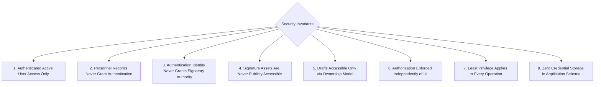
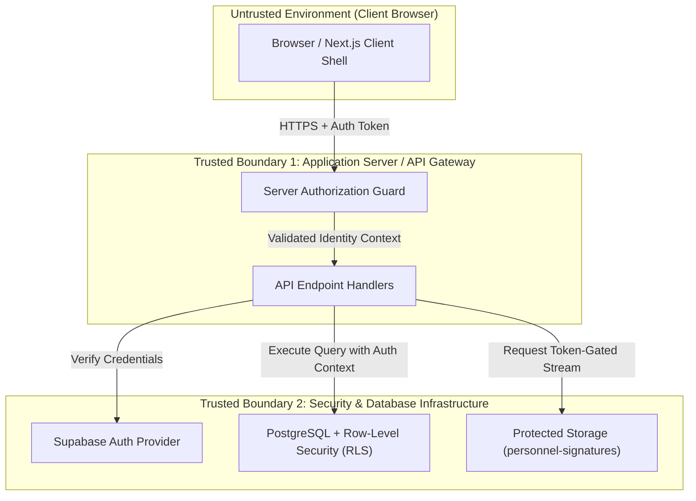
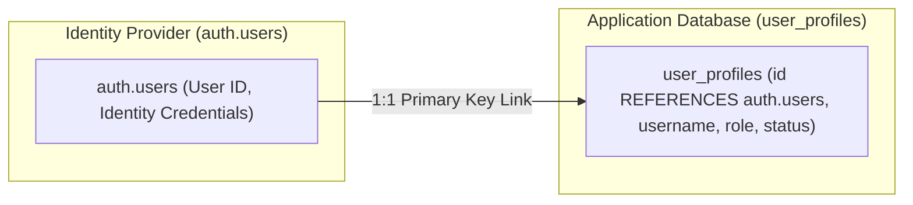
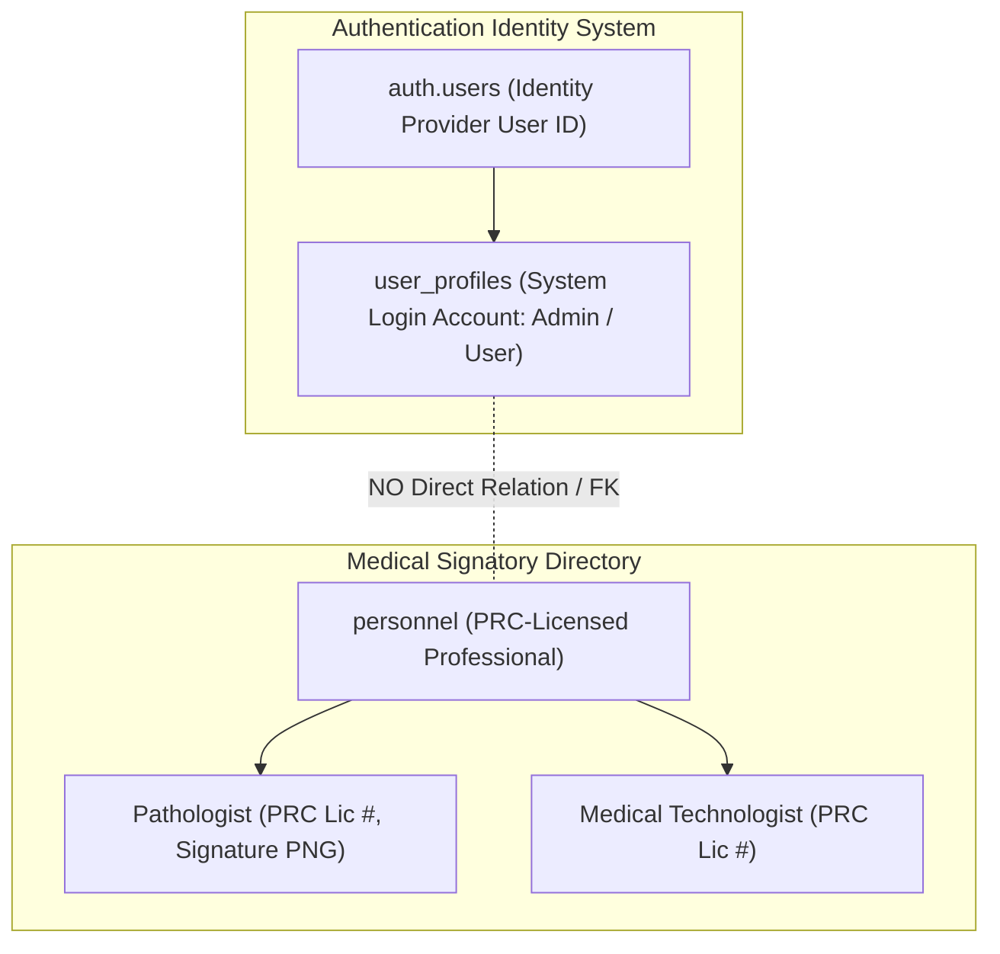

# St. Rose Laboratory Result Management System
## Security Model & Architecture Specification

---

# 1. Purpose & Architectural Status

This document defines the official **Security Model Specification** for the **St. Rose Laboratory Result Management System**.

It specifies the security architecture, threat model, trust boundaries, authentication responsibilities, role-based authorization (RBAC), authentication user vs. personnel decoupling, database-level security policies, signature storage protection, mandatory audit logging requirements, and information disclosure defenses.

## 1.1 Authority Hierarchy Alignment

This document operates strictly within the project authority hierarchy:

1. **PROJECT.md**: Authoritative source for project vision, milestone roadmaps, technology stack, and system-wide business rules.
2. **LABORATORY_TEMPLATE_SPECIFICATION.md**: Authoritative specification for official laboratory report templates, parameter definitions, reference rules, signatories, and renderer behavior.
3. **Architecture/DOMAIN_MODEL.md (FROZEN)**: Authoritative business domain specification defining entities, aggregate roots, value objects, domain services, lifecycles, and business invariants.
4. **Architecture/DATABASE_DESIGN.md (FROZEN)**: Authoritative relational database architecture and schema specification.
5. **Architecture/REPORT_REGISTRY_ARCHITECTURE.md (FROZEN)**: Authoritative Report Registry metadata specification.
6. **Architecture/REPORT_RENDERING_ARCHITECTURE.md (FROZEN)**: Authoritative Report Rendering architecture specification.
7. **Architecture/UI_ARCHITECTURE.md (FROZEN)**: Authoritative Application UI architecture specification.
8. **Current Source Code**: Contextual reference only. Code never overrides architecture specifications.

---

# 2. Security Principles & Goals

## 2.1 Security Principles

1. **Defense in Depth**: Security controls are enforced at multiple independent layers: Client Route Guards, Server API Authorization, and Database-Enforced Row-Level Security (RLS) policies.
2. **Principle of Least Privilege**: Users are granted minimum operational access required for their role. Non-administrative users cannot manage accounts or personnel master data.
3. **Zero Local Password Storage**: The application database **never** stores password hashes or identity credentials. Supabase Auth exclusively manages authentication credentials.
4. **Strict Identity Decoupling**: Application login identities (`user_profiles`) and PRC-licensed medical professionals (`personnel`) are completely separate entities.
5. **Report & Signature Integrity**: Pathologist signature images are stored in protected storage with restricted access policies. Completed reports are protected against unauthorized modification.

## 2.2 Security Goals

- **Authentication Integrity**: Ensure only authorized, active laboratory staff can access the system.
- **Role Enforcement**: Restrict user management and personnel maintenance strictly to `Admin` users.
- **Data Protection**: Safeguard patient demographics, laboratory result data, and medical professional signature assets.
- **Auditability**: Define mandatory audit logging requirements for administrative actions, session submissions, and personnel updates.

---

# 3. Security Invariants

The Security Model defines eight non-negotiable **Security Invariants**. These invariants represent mandatory security contracts:

> **CRITICAL SECURITY CONTRACT**: Any code, API, or database change violating these invariants is an explicit security defect.

## 3.1 Detail of Security Invariant Specifications

1. **Authenticated Active User Access**: Only authenticated users with an active application account (`status = 'Active'`) may access protected system resources or database records.
2. **Personnel Record Isolation**: Personnel records (`personnel`) represent PRC-licensed medical professionals and **never** grant authentication or system login capability.
3. **Signatory Authority Isolation**: Authentication identities (`user_profiles`) represent system login accounts and **never** grant medical signatory authority on report outputs.
4. **Non-Public Signature Storage**: Signature assets in storage are non-public and **never** accessible via unauthenticated or direct public URLs.
5. **Draft Access Boundaries**: Drafts are accessible only according to active user session context and ownership rules.
6. **UI-Independent Authorization**: Security controls are enforced at server API and database layers, independently of client UI controls.
7. **Least Privilege Enforcement**: Non-administrative users are strictly prohibited from performing administrative operations regardless of API payload manipulation.
8. **Zero Local Credential Storage**: Application database tables store **zero** password hashes or authentication credentials.

---

# 4. Trust Boundaries & Threat Model

## 4.1 Trust Boundaries

## 4.2 Threat Model & Mitigation Matrix

| Threat Vector | Potential Impact | Architectural Defense |
|---|---|---|
| **Unauthorized System Access** | Unauthenticated user views patient data or generates reports | Identity provider authentication required for all routes/APIs. Real-time active status check rejects inactive accounts immediately. |
| **Privilege Escalation** | `User` role attempts to create admin accounts or edit personnel | Server authorization and database RLS policies enforce `role = 'Admin'` for write operations on `user_profiles` and `personnel`. |
| **Insecure Direct Object References (IDOR)** | User modifies another session by manipulating URL entity IDs | Database Row-Level Security (RLS) evaluates caller authorization context on every entity access. |
| **Sensitive Information Disclosure** | Leaking stack traces, internal errors, or unselected test data | Server sanitizes error responses. Deselected parameters (`is_selected = false`) are scrubbed before persistence. |
| **Signature Asset Leakage** | Direct public downloading or hotlinking of official signature PNGs | Storage bucket is **non-public**. Served only via authenticated API endpoints or temporary time-limited access tokens. |
| **Audit Log Tampering** | Malicious actor alters or erases security event history | Audit logging operates within an append-only boundary inaccessible to standard application queries. |
| **Session Misuse** | Revoked/deactivated staff member continues using active token | Every API request checks active user status (`status = 'Active'`). Deactivation revokes access instantly. |

---

# 5. Authentication Architecture (Supabase Auth)

## 5.1 Identity & Credential Separation

Authentication is powered by **Supabase Auth**:

- **Identity Provider Responsibilities**: Manages primary user identity, credential validation, token issuance, and session revocation.
- **Application Profile Responsibilities (`user_profiles`)**: Stores domain-specific authorization metadata (`username`, `role`, `status`) referencing `auth.users(id)` via `UUID PRIMARY KEY`.
- **Decoupling Rule**: `user_profiles` maintains **zero connection** to `personnel`.

---

# 6. Authorization Model & Completed Report Authorization

The application enforces a 2-tier Role-Based Access Control (RBAC) model across all resources:

## 6.1 Role Definitions

- **`Admin`**: Full system administration access. Retains system-wide administrative authority to manage user accounts, toggle account active/inactive status, manage personnel directory, upload signature assets, create patient sessions, encode results, launch previews, print reports, and view history across all laboratory records.
- **`User`**: Clinical operational access. Can create patient sessions, encode results, manage drafts, replace completed reports within the allowed 30-day retention window, launch previews, print reports, and view history. Cannot access `/users` or `/personnel`.

## 6.2 Confirmed Rules for Completed Reports

1. **30-Day Retention Boundary**: Completed reports are retained for **30 days** (`expires_at = completed_at + 30 days`).
2. **Replacement within Retention**: Authorized users may reopen, preview, print, regenerate PDF, and replace the current report within the allowed 30-day retention period. Replaces active report record and signatory snapshots without version branching.
3. **No Version History**: There is **no version history** in the initial release (single-record replacement semantics).
4. **UI-Independent Authorization**: Authorization must be enforced outside the client UI (at both Server API and Database RLS layers).
5. **Immutability of Expired Reports**: Expired reports (`expires_at < NOW()`) cannot be edited or replaced under any circumstances.

> [!WARNING]
> **UNRESOLVED AUTHORIZATION POLICY DECISION**:
> **Completed Report visibility and edit scope across different users requires client confirmation.**
> 
> Current authority documents do not explicitly establish whether standard `User` accounts may view/edit:
> - **All completed laboratory reports system-wide** across the entire laboratory, or
> - **Only Patient Report Sessions they originally created**.
> 
> To preserve requirements integrity, this scope is **NOT** inferred or hardcoded in architecture. The database architecture permits either policy via RLS adjustments once client confirmation is received.

## 6.3 Authorization Matrix for Completed Reports

| Action on Completed Report | `User` Role | `Admin` Role | Enforcement Boundary & Condition |
|---|---|---|---|
| **View Completed Report** | Allowed (Scope TBD) | Allowed (System-Wide) | Authenticated Active User required. |
| **Launch Preview** | Allowed (Scope TBD) | Allowed (System-Wide) | Authenticated Active User required. Invokes shared rendering engine. |
| **Print Report** | Allowed (Scope TBD) | Allowed (System-Wide) | Authenticated Active User required. Invokes print stream target. |
| **Export PDF** | Allowed (Scope TBD) | Allowed (System-Wide) | Authenticated Active User required. Invokes PDF output adapter. |
| **Edit / Replace Report** | Allowed (Scope TBD) | Allowed (System-Wide) | Allowed **only** within 30-day retention window (`completed_at + 30 days`). |
| **Edit Expired Report** | **Denied** | **Denied** | Immutability rule: Expired reports (`expires_at < NOW()`) cannot be edited. |

---

# 7. Separation of Authentication Users and Personnel

The system strictly enforces the separation of **Authentication Users** (`user_profiles`) and **Personnel** (`personnel`):

---

# 8. Database Security Strategy (Row-Level Security)

Database security is enforced via PostgreSQL Row-Level Security (RLS) on **all 10 application tables**:

## 8.1 Active Status Verification Requirement

All database RLS policies evaluate caller identity context and verify that the requesting account is active (`status = 'Active'`). If the account is inactive or unauthenticated, all database operations are denied.

## 8.2 Summary of Database RLS Boundaries

- **Read Operations (`SELECT`)**: Restricted to authenticated active users for operational tables.
- **Administrative Write Operations (`INSERT`/`UPDATE`/`DELETE`)**: Restricted strictly to active `Admin` users for `user_profiles`, `personnel`, and template configuration tables (`report_templates`, `template_parameters`, `template_signatory_requirements`).
- **Operational Write Operations**: Allowed for active `Admin` and `User` accounts for `patient_report_sessions`, `laboratory_reports`, `laboratory_results`, `report_signatories`, and `auto_suggestions`.

---

# 9. Storage Security for Signature Assets

Pathologist PNG signature images represent sensitive legal medical assets:

- **Storage Bucket Boundary**: Stored in a **non-public** storage bucket (`personnel-signatures`).
- **Access Rule**: Direct unauthenticated HTTP downloads are blocked.
- **Delivery Mechanism**: Served exclusively via authenticated API proxy handlers or short-lived, time-limited token-gated access URLs.

---

# 10. Mandatory Audit Logging Architecture Requirements

> [!IMPORTANT]
> The audit logging requirements defined below represent **security architecture requirements for software implementation**, not pre-existing or already implemented functionality.

Security-relevant operations across the system must be logged to an append-only audit boundary.

## 10.1 Mandated Audit Event Categories

1. **Authentication & Account Security Events**:
   - User account creation
   - User status changes (Active <-> Inactive)
   - User role modifications
   - Password reset requests
2. **Personnel & Credential Events**:
   - Personnel record creation or modification
   - PRC license number updates
   - Pathologist PNG signature asset uploads or replacements
3. **Session Lifecycle & Report Events**:
   - Patient Report Session creation
   - Session completion & signatory snapshot freezing
   - Report replacement within the 30-day window
   - Automated retention purge execution
4. **Security Access & Denial Events**:
   - Unauthorized access attempts to administrative routes (`/users`, `/personnel`)
   - Failed authentication attempts
   - Direct signature asset access denials

---

# 11. Information Disclosure Defenses

- **Client Response Sanitization**: Error messages returned to client applications are generic and sanitized. Internal system details, stack traces, and database errors are withheld.
- **Server Log Isolation**: Detailed error logs, stack traces, and security diagnostics are stored strictly in server-side logs.
- **Scrubbing Deselected Parameters**: Parameters marked `is_selected = false` are scrubbed before persistence and are never leaked to client state or storage.

---

# 12. Architectural Consistency Verification Matrix

| Architecture Requirement / Invariant | Security Model Mapping | Status |
|---|---|---|
| **Zero Credential Storage** | Identity provider owns credentials; application schema stores zero hashes | ✅ Pass |
| **Auth User vs Personnel Decoupling** | `user_profiles` and `personnel` strictly separated; zero FKs | ✅ Pass |
| **Security Invariants** | Section 3 documents 8 non-negotiable security contracts | ✅ Pass |
| **Unresolved Policy Documented** | "Completed Report visibility and edit scope across different users requires client confirmation." | ⚠️ Recorded |
| **30-Day Retention Rules** | 30-day replacement allowed; expired reports immutable; no version history | ✅ Pass |
| **Audit Categories Specification** | Section 10 explicitly frames 4 audit categories as implementation requirements | ✅ Pass |
| **Signature Asset Security** | Non-public storage bucket; served via authenticated token-gated access | ✅ Pass |
| **Authority Baseline Alignment** | 100% consistent with all 7 frozen authority specifications | ✅ Pass |
