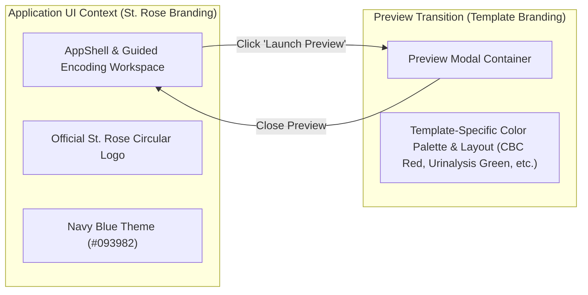
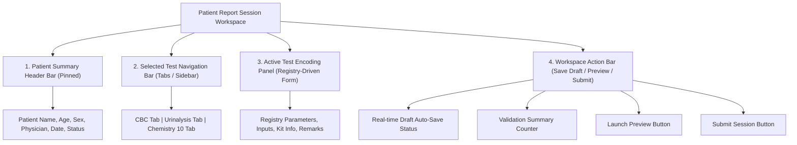

# St. Rose Laboratory Result Management System
## Application User Interface (UI) Architecture Specification

---

# 1. Purpose & Architectural Status

This document defines the official **Application UI Architecture Specification** for the **St. Rose Laboratory Result Management System**.

It specifies the application shell layout, route organization, module boundaries, guided workspace architecture, dynamic form generation, navigation guards, keyboard workflows, preview transition rules, responsive layouts, accessibility standards, and state handling.

## 1.1 Authority Hierarchy Alignment

This document operates strictly within the project authority hierarchy:

1. **PROJECT.md**: Authoritative source for project vision, milestone roadmaps, technology stack, and system-wide business rules.
2. **LABORATORY_TEMPLATE_SPECIFICATION.md**: Authoritative specification for official laboratory report templates, parameter definitions, reference rules, signatories, and renderer behavior.
3. **Architecture/DOMAIN_MODEL.md (FROZEN)**: Authoritative business domain specification defining entities, aggregate roots, value objects, domain services, lifecycles, and business invariants.
4. **Architecture/DATABASE_DESIGN.md (FROZEN)**: Authoritative relational database architecture and schema specification.
5. **Architecture/REPORT_REGISTRY_ARCHITECTURE.md (FROZEN)**: Authoritative Report Registry metadata specification.
6. **Architecture/REPORT_RENDERING_ARCHITECTURE.md (FROZEN)**: Authoritative Report Rendering architecture specification.
7. **Current Source Code**: Contextual reference only. Code never overrides architecture specifications.

---

# 2. UI Boundaries & Independent Branding Transition

## 2.1 Technical Boundaries

- **IN SCOPE**: Application shell composition, guided encoding workspace layout, client-side route partitioning, registry-driven form generation, interaction states (loading, empty, error, validation), draft auto-save UX, navigation guards, keyboard workflows, preview modal triggers, and responsive layout rules.
- **EXCLUDED**: Database tables (governed by `DATABASE_DESIGN.md`), Report Registry definitions (governed by `REPORT_REGISTRY_ARCHITECTURE.md`), and pixel-level DOM print rendering rules (governed by `REPORT_RENDERING_ARCHITECTURE.md`).

## 2.2 Dual Independent Branding & Preview Transition Rules

The application enforces a strict, explicit branding transition model:

1. **Application Shell & Encoding Workspace**:
   - Always uses the official **St. Rose Diagnostic Laboratory** circular blue logo (`public/st-rose-logo.png`) and application brand tokens (`#093982` St. Rose Navy Blue, `#1d5ea5` hover, `#ebf3fa` active nav tint).
   - Governs Dashboard, Navigation, Forms, Modals, Tables, Buttons, and System Badges.

2. **Report Preview Transition & Instant Branding Switch**:
   - Clicking **"Launch Preview"** opens the Report Preview modal.
   - The document viewport **immediately switches** to the official template branding, colors (`report_templates.color_palette`), typography, headers, and borders defined by the selected test template.
   - **Return Transition**: Closing the Preview modal **instantly restores** the St. Rose application UI branding context without altering form state or active tab focus.

---

# 3. Guided Encoding Workspace Architecture

Rather than partitioning patient visit creation across multiple disconnected URL pages, the Patient Report Session is modeled as a unified, stateful **Guided Encoding Workspace**.

## 3.1 Why Guided Workspace Architecture Supersedes Separate Pages

- **High-Throughput Workflow**: Medical Technologists routinely encode multi-test visits (e.g. CBC + Urinalysis + Chemistry 10). A unified workspace eliminates full-page reloads and state resets.
- **Memory Continuity**: Patient demographics and shared Chemistry parameters remain in active state while staff toggle between test tabs.
- **Real-Time Validation**: Validation errors across all selected tests are summarized in a persistent workspace toolbar.

## 3.2 High-Level Workspace Composition

1. **Patient Summary Header Bar (Pinned Top)**:
   - Displays patient name, age, sex, physician, visit date, and status (`OutPatient`/`InPatient`/`ER`).
   - Features an `Edit Demographics` action to open a demographic drawer without leaving the encoding workspace.
2. **Selected Test Navigation Bar**:
   - Tab-based navigation bar displaying all selected tests for the visit.
   - Indicates completion status per test (e.g., `CBC ✓`, `Urinalysis (Incomplete)`).
3. **Active Test Encoding Panel**:
   - Renders the metadata-driven dynamic form for the currently active test tab.
4. **Workspace Action Bar (Fixed Bottom)**:
   - **Real-Time Draft Status Indicator**: Displays auto-save status (`"Draft Saved 2s ago"`, `"Unsaved Changes"`).
   - **Validation Summary Counter**: Badge showing missing required fields or signatory validation status.
   - **Actions**: `Save Draft`, `Launch Preview`, `Submit Session`.

---

# 4. AppShell, Route Partitioning & Module Boundaries

## 4.1 Application Shell Composition

- **Sidebar**: Fixed `256px` (`w-64`) left sidebar with white background (`#ffffff`), official logo (`h-11`), and active link highlights (`#ebf3fa` tint with `#093982` icon/text). Collapses into a backdrop drawer on mobile screens.
- **Header**: Sticky top header (`h-16`) displaying current route title (`text-lg font-bold`), breadcrumbs, mobile drawer toggle, and "System Ready" status badge.

## 4.2 Route Organization

| Route Path | Module Name | Role Access | Primary Purpose |
|---|---|---|---|
| `/dashboard` | Dashboard | All Roles | Overview metrics, operational status, quick action shortcuts |
| `/users` | User Management | `Admin` Only | Manage staff login accounts, roles (`Admin`/`User`), activation status |
| `/personnel` | Personnel Management | `Admin` Only | Maintain licensed Pathologists and MedTechs, PRC numbers, signature references |
| `/workspace` | Guided Session Workspace | All Roles | Unified patient session creation, test selection, and result encoding |
| `/history` | Completed History | All Roles | 30-day retention list, Edit/Replace report, launch Preview, export PDF |

---

# 5. Dynamic Form Architecture & Interaction Rules

## 5.1 Registry-Driven Dynamic Form Generation

Form controls are generated dynamically by querying `ReportRegistry` specifications without component hardcoding:
- **`NumericText`**: Input + unit suffix (`g/dL`, `mmol/L`, `%`, `/HPF`, etc.).
- **`FreeText`**: Textarea / input for qualitative findings or remarks.
- **`SingleSelect`**: Strict dropdown (`POSITIVE`/`NEGATIVE`, `REACTIVE`/`NON-REACTIVE`, `A`/`B`/`AB`/`O`, `Positive`/`Negative`).
- **`Combobox`**: Choice dropdown + manual text entry (Urinalysis/Fecalysis qualitative fields).
- **`Computed`**: Read-only calculated field displaying client-confirmed formulas (e.g., LDL calculation in `HDL_LDL` / `CHEM_10`).

## 5.2 Specific Input Behaviors
- **Urinalysis Crystal Selection**: User-controlled dropdown (`None` | `Amorphous Urates` | `Amorphous Phosphates`). Selecting `None` hides the crystal row from the rendered report.
- **Reagent Kit Traceability**: Displays Kit Brand, Lot Number, and Expiration Date inputs when `requires_kit_info = TRUE`.
- **Parameter Selection**: Panel-level "Select All" / "Deselect All" + per-parameter toggle (`is_selected`). Deselected parameters disable inputs, skip validation/abnormal evaluation, and are omitted from persistence and printed reports.
- **Abnormal Result Warning Presentation**: Visual warning badges display inside the encoding form interface only; **warnings MUST NEVER alter official printed report layouts.**

---

# 6. Navigation Guards & Keyboard Workflows

## 6.1 Navigation Guard Behavior

To prevent accidental data loss during encoding:
- **Unsaved Changes Detection**: If unsaved edits exist in the workspace, attempting to navigate away (clicking sidebar links, browser back button, closing tab) triggers a Navigation Guard alert.
- **Alert Dialog**: Prompts staff: *"You have unsaved laboratory encoding changes. Leave without saving?"*
- **Automatic Draft Persistence**: Background auto-save persists active form inputs prior to navigation execution.

## 6.2 Keyboard-First Workflow Guidelines

To maximize encoding speed for laboratory staff:
- `Tab` / `Shift+Tab`: Advances focus sequentially down parameter result fields.
- `Enter` / `Down Arrow`: Fast numeric entry progression (commits current field and advances focus to the next parameter result input).
- `Ctrl + S` / `Cmd + S`: Triggers manual **Save Draft**.
- `Ctrl + P` / `Cmd + P`: Triggers **Launch Preview**.
- `Spacebar` / `Arrow Keys`: Toggles `SingleSelect` options or `is_selected` checkboxes.

---

# 7. Desktop-First Responsive Strategy

The system is designed **Desktop-First** for high-throughput laboratory workstations, while remaining fully responsive across form factors:

| Form Factor | Screen Width | Layout & UX Behavior |
|---|---|---|
| **Desktop (Primary)** | `>= 1024px` | Full multi-column workspace layout with side-by-side test tabs, pinned patient summary header, multi-column form grids, and persistent action bar. |
| **Tablet** | `768px - 1023px` | Collapsible sidebar, 2-column dynamic form grid, drawer-based test switcher, sticky bottom action bar. |
| **Mobile** | `< 768px` | Stacked single-column layout with full-width inputs, collapsible navigation drawer, mobile test drawer switcher. Fully functional for emergency result entry or mobile verification. |

---

# 8. Draft Recovery & Retention History UX

## 8.1 Draft Recovery UX
- Unfinished session changes auto-save transiently to local draft storage.
- Reopening the workspace displays a **Draft Recovery Banner** ("Resume Unfinished Draft" or "Discard & Start Fresh").

## 8.2 Completed Report History UX (`/history`)
- Displays completed sessions retained within the **30-day window** with expiration countdown ("Expires in 18 days").
- **Actions**: View / Launch Preview, Edit / Replace Current Report (submitting replaces session without version branching), Print, Export PDF.

---

# 9. Architectural Consistency Verification Matrix

| Requirement / Invariant | UI Architecture Solution | Status |
|---|---|---|
| **Guided Workspace Model** | Unified stateful workspace replaces disconnected pages | ✅ Pass |
| **Dual Branding Transition** | System UI uses St. Rose logo; Preview switches to template palette | ✅ Pass |
| **Navigation Guards** | Unsaved changes trigger interceptor alert & draft auto-save | ✅ Pass |
| **Keyboard Workflow** | `Enter`/`Tab` progression, `Ctrl+S` draft, `Ctrl+P` preview | ✅ Pass |
| **Desktop-First Responsive** | Multi-column desktop layout; 2-col tablet; stacked mobile | ✅ Pass |
| **Shared Chemistry Workflow** | Shared menu for `CHEM_8`, `CHEM_10`, `HDL_LDL`, `RBS` | ✅ Pass |
| **Urinalysis Crystal UX** | User-controlled dropdown (`None`, `Urates`, `Phosphates`); `None` hides row | ✅ Pass |
| **HIV Signatories UX** | Enforces 1 Pathologist + 2 MedTechs for `HIV_RESULT` | ✅ Pass |
| **Database & Registry Alignment**| 100% consistent with frozen authority specifications | ✅ Pass |
